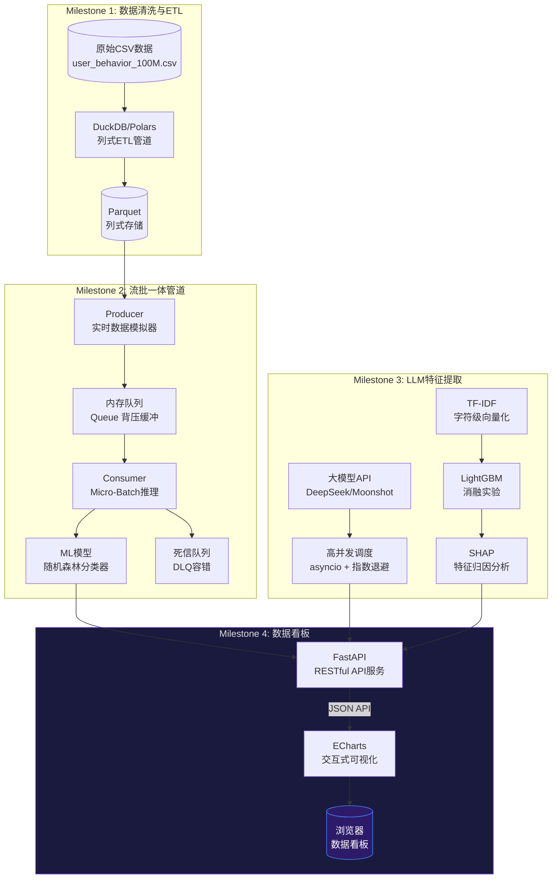

# 📊 大数据分析看板 · Big Data Analytics Dashboard

> **基于轻量级高性能数据栈 + 大语言模型 API 的高校课程实验交付项目**
>
> Milestone 4 · 前后端分离架构 · FastAPI + ECharts

---

## 🎯 项目简介与特色

本项目是一个完整的**电商评论大数据分析系统**，覆盖从原始数据采集、流式处理、LLM 特征提取、机器学习建模到 Web 数据看板的完整数据工程链路。

### 核心技术特色

| 特色 | 说明 |
|------|------|
| ⚡ **千万级脱敏日志极速 ETL** | 基于 DuckDB/Polars 的列式处理引擎，支持百万行级数据的秒级聚合 |
| 🌊 **流式背压管道与 ML 实时打标** | Producer-Consumer 模式 + 内存队列 + 背压控制，支持 QPS 灵活调节 |
| 🤖 **高并发大模型调用的容错设计** | 异步并发 + 指数退避重试 + 死信队列（DLQ），确保 LLM API 调用零数据丢失 |
| 📈 **前后端解耦的动态可视化看板** | FastAPI RESTful API + ECharts 交互式图表，支持双向联动、正则检索、子维度下钻、高频词分析 |

---

## 🏗️ 系统架构与数据流拓扑



---

## 🚀 快速开始与部署指南

### 环境要求

- Python 3.11+
- Windows / macOS / Linux
- 至少 4GB 可用内存

### 从零搭建

```bash
# 1. 克隆项目
git clone <your-repo-url>
cd BigDataCourse

# 2. 创建虚拟环境
python -m venv venv
# Windows:
venv\Scripts\activate
# macOS/Linux:
source venv/bin/activate

# 3. 安装依赖
pip install -r requirements.txt

# 4. 一键启动看板
python run_app.py
```

启动后，浏览器将自动打开 `http://localhost:8000`。

### 可选：单独启动各阶段 Pipeline

```bash
# M2: 流处理管道（实时数据模拟 + ML预测打标）
cd 实验八
python run_pipeline.py --qps 200 --max_records 10000

# M3: 异构特征融合 + 消融实验 + SHAP 分析
cd 实验十一
python run_fusion_pipeline.py --balanced

# M4: 交互式数据看板（独立启动）
cd 实验十三/dashboard
uvicorn server:app --reload --port 8000
```

---

## ⚙️ 配置说明

### 大模型 API Key 配置

系统支持通过环境变量配置大模型 API Key。若未配置，系统将**自动降级运行**（使用内置规则库），控制台和前端看板均有明确提示。

```bash
# Windows PowerShell
$env:DEEPSEEK_API_KEY = "sk-your-key-here"

# macOS / Linux
export DEEPSEEK_API_KEY="sk-your-key-here"
```

支持的环境变量名：`DEEPSEEK_API_KEY`、`SILICONFLOW_API_KEY`、`DASHSCOPE_API_KEY`、`OPENAI_API_KEY`、`MOONSHOT_API_KEY`

### 更改默认端口

```bash
python run_app.py --port 8080
```

### 不自动打开浏览器

```bash
python run_app.py --no-browser
```

---

## 📁 项目目录树

```
BigDataCourse/
├── run_app.py                  # 🚀 一键启动脚本（入口）
├── requirements.txt            # 📦 核心依赖清单
├── README.md                   # 📖 项目文档（本文件）
├── .gitignore                  # 🔒 Git 忽略规则
│
├── 实验一/     # M1: 数据生成与统计
├── 实验二/  # M1: 存储格式对比
├── 实验三/     # M1: 数据清洗与会话
├── 实验四/    # M1: ETL与特征工程
├── 实验五/           # M1: 性能基准测试
│
├── 实验六/ # M2: 流监听与背压
├── 实验七/ # M2: ML流式打标
├── 实验八/                       # M2: 流处理管道统一入口
│   ├── run_pipeline.py          #   Producer + Consumer + ML预测
│   └── model.pkl                #   训练好的随机森林模型
│
├── 实验九/ # M3: LLM API接入
│   └── run_pipeline.py          #   高并发LLM特征提取
│
├── 实验十/                       # M3: 高并发管道与容错
│   └── run_async_pipeline.py    #   异步并发 + 指数退避
│
├── 实验十一/                     # M3: 异构特征融合
│   └── run_fusion_pipeline.py   #   TF-IDF + LightGBM + SHAP
│
├── 实验十二/                     # M4: 前后端分离基础
│   └── dashboard/
│       ├── server.py            #   FastAPI (3个API端点)
│       └── frontend/index.html  #   基础双图表看板
│
├── 实验十三/                     # M4: 高级交互看板（当前主版本）
│   └── dashboard/
│       ├── server.py            #   FastAPI (5个API端点, 增强版)
│       └── frontend/index.html  #   完整交互看板
│
└── 共享数据/                     # 共享大数据文件
    ├── user_behavior_100M.csv   #   1亿条脱敏用户行为日志
    └── user_behavior_5M.csv     #   500万条子集
```

---

## 🛡️ 系统状态与降级策略

当系统启动时，会自动检测大模型 API Key 配置状态：

- ✅ **API Key 已配置**：系统全功能运行，LLM 特征提取可用
- ⚠️ **API Key 未配置**：系统自动降级，使用内置规则库计算，看板顶部显示黄色横幅提示

可通过 `/api/system-status` 接口查询系统运行状态：

```json
{
  "status": "degraded",
  "llm_active": false,
  "reason": "API_KEY_MISSING",
  "data_files_available": true,
  "record_count": 62774
}
```

---

## 📄 许可

本项目为高校课程实验交付项目，仅供学习与研究使用。
