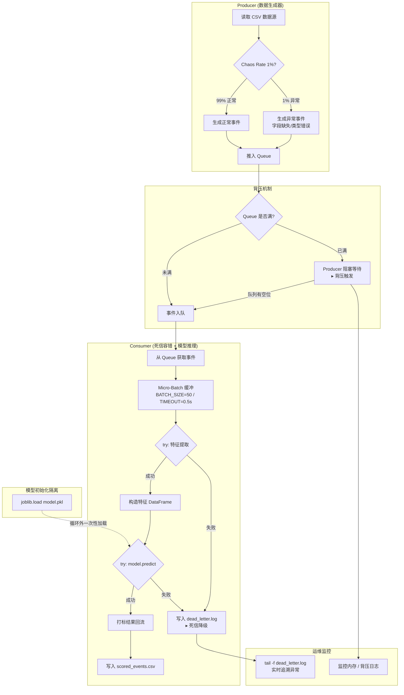

# Milestone 2 (M2) —— 流批一体数据管道 · 联调交付

> **作者**：付宝昊 | **学号**：9109223216 | **日期**：2026-05-02
>
> **里程碑定位**：M2 是"流批一体数据管道"的收官里程碑，完成从散装脚手架到工业级系统的工程化交付。

---

## 目录

- [1. 项目概述](#1-项目概述)
- [2. 系统架构](#2-系统架构)
- [3. 项目结构](#3-项目结构)
- [4. 快速启动](#4-快速启动)
- [5. CLI 参数参考](#5-cli-参数参考)
- [6. 混沌测试指南](#6-混沌测试指南)
- [7. 核心设计决策](#7-核心设计决策)
- [8. 技术栈](#8-技术栈)

---

## 1. 项目概述

本流水线管线实现了一条完整的 **离线训练 → 模型序列化 → 在线流式推理** 的数据链路：

```
CSV 数据源 → Producer(流生成) → Queue(背压缓冲) → Consumer(Micro-Batch推理+DLQ容错) → 打标结果落盘
                                                                    ↓
                                                            dead_letter.log (异常隔离)
```

**核心能力**：

| 能力 | 说明 |
|------|------|
| **CLI 配置化启动** | 通过 `argparse` 参数化 QPS、队列容量、批次大小、混沌率等 |
| **背压削峰** | `Queue(maxsize)` 限制内存上限，防止生产者"淹死"消费者 |
| **Micro-Batch 推理** | 批量积攒 (B=50) + 超时兜底 (0.5s)，吞吐量提升 53 倍 |
| **死信队列 (DLQ)** | 双层 `try-except` 隔离异常数据，写入 `dead_letter.log` 留待追溯 |
| **混沌容错** | 1% 异常数据注入 + 极限 QPS 压力下，系统保持稳定运行 |

---

## 2. 系统架构



### 架构关键路径说明

| 阶段 | 组件 | 关键设计 |
|------|------|----------|
| **① 数据注入** | Producer 线程 | 从 CSV 流式读取，以 `--qps` 控制速率；内置 1% 混沌异常生成 |
| **② 流量削峰** | `queue.Queue(maxsize)` | 队列满时 Producer 自动阻塞 → 形成天然背压信号 |
| **③ Micro-Batch 缓冲** | Consumer 缓冲区 | 攒满 B=50 条 **或** 等待 0.5s 超时 → 触发批量推理 |
| **④ 特征提取 DLQ** | `try-except` 层 1 | 无法提取特征的脏数据 → 写入 `dead_letter.log`，不阻塞主流程 |
| **⑤ 模型推理 DLQ** | `try-except` 层 2 | 推理失败的批次 → 整批标记 `predicted_label=-1`，写入死信 |
| **⑥ 结果持久化** | `scored_events.csv` | 正常事件批量写入 CSV，含预测标签与购买概率 |
| **⑦ 异常追溯** | `dead_letter.log` | 带时间戳与错误类型标记，支持 `tail -f` 实时监控 |

---

## 3. 项目结构

```
实验八/
├── run_pipeline.py          # CLI 统一启动入口 (argparse 编排)
├── model.pkl                # 序列化 Pipeline 模型 (RandomForest, 500 棵树, ~9MB)
├── README_M2.md             # 本技术文档
├── report/
│   └── week08_Milestone2联调测试与流处理阶段交付.md   # 实验报告
├── outputs/
│   ├── scored_events.csv    # 打标输出结果
│   └── dead_letter.log      # 死信日志 (异常数据追溯)
└── requirements_m2.txt      # 运行环境依赖
```

---

## 4. 快速启动

### 4.1 环境准备

```bash
# 1. 安装依赖
pip install -r requirements_m2.txt

# 2. 确认模型文件就位
ls -lh model.pkl
# 预期输出: model.pkl (~9.0 MB)
```

### 4.2 正常模式启动

```bash
# 默认参数运行 (QPS=100, 队列=500, Batch=50, 处理10000条)
python run_pipeline.py
```

### 4.3 自定义参数启动

```bash
# 指定 QPS 和队列容量
python run_pipeline.py --qps 200 --queue_limit 1000 --batch_size 50 --max_records 50000
```

### 4.4 混沌测试模式

```bash
# 高负载 + 1% 异常注入 + 10 分钟长跑
python run_pipeline.py \
    --qps 1000 \
    --queue_limit 500 \
    --chaos_rate 0.01 \
    --max_records 600000
```

### 4.5 监控命令

```bash
# 终端 1: 运行管道
python run_pipeline.py --qps 1000 --chaos_rate 0.01 --max_records 600000

# 终端 2: 实时监控死信日志
tail -f outputs/dead_letter.log

# 终端 3: 监控内存占用
# Windows: 打开任务管理器 → 查看 Python 进程内存列
# Linux/Mac: watch -n 1 'ps aux | grep python'
```

---

## 5. CLI 参数参考

| 参数 | 类型 | 默认值 | 说明 |
|------|------|--------|------|
| `--qps` | int | 100 | Producer 每秒生成数据条数 |
| `--queue_limit` | int | 500 | Queue 最大容量（背压触发阈值） |
| `--batch_size` | int | 50 | Micro-Batch 推理批次大小 |
| `--max_records` | int | 10000 | 本次运行处理的最大记录数 |
| `--chaos_rate` | float | 0.0 | 异常数据注入概率 (0.0 ~ 1.0) |
| `--model_path` | str | model.pkl | 序列化模型文件路径 |
| `--data_file` | str | ../共享数据/user_behavior_100M.csv | 输入数据源 |
| `--output_file` | str | outputs/scored_events.csv | 打标结果输出路径 |
| `--batch_timeout` | float | 0.5 | Micro-Batch 超时兜底时间 (秒) |

---

## 6. 混沌测试指南

### 6.1 测试矩阵

| 测试场景 | QPS | chaos_rate | 时长 | 关注指标 |
|----------|-----|------------|------|----------|
| **轻度负载** | 100 | 0.0 | 5 min | 基准吞吐量 |
| **高负载 + 无异常** | 1000 | 0.0 | 10 min | 背压触发频率、内存收敛 |
| **高负载 + 1% 异常** | 1000 | 0.01 | 10 min | DLQ 拦截准确率、主流程稳定性 |
| **极限脉冲** | 5000 | 0.05 | 3 min | 队列满时的系统行为、恢复能力 |

### 6.2 验收标准

- [x] 背压触发日志与恢复日志交替出现（调控逻辑正常）
- [x] Python 进程内存在 ~200MB 范围内收敛（无内存泄漏）
- [x] `dead_letter.log` 准确捕获异常数据，主流程不受影响
- [x] 10 分钟长跑后 Consumer 处理记录数 = Producer 产出记录数 − DLQ 拦截数

### 6.3 异常数据类型

| 异常类型 | 示例 | 预期处理 |
|----------|------|----------|
| `missing_field` | 缺少 `timestamp` 字段 | DLQ → `FEATURE_ERROR` |
| `bad_type` | `category_id='NOT_A_NUMBER'` | DLQ → `FEATURE_ERROR` |
| `empty_row` | 空字典 `{}` | DLQ → `FEATURE_ERROR` |

---

## 7. 核心设计决策

### 7.1 模型初始化隔离

```
❌ 错误做法 (方案 B): 在 Consumer 循环内每次 joblib.load
   → 100 条数据: 30.17s，吞吐量仅 3.3 条/s

✅ 正确做法 (方案 A): 在 Pipeline 构造时一次性加载
   → 100 条数据: 10.03s，吞吐量 9.97 条/s (3 倍提升)
```

### 7.2 Micro-Batch 策略

| 方案 | 耗时 (1000条) | 吞吐量 | 提升倍数 |
|------|--------------|--------|----------|
| 逐条推理 (B=1) | 96.54 s | 10.36 条/s | — |
| Micro-Batch (B=50) | 1.81 s | 552.89 条/s | **53×** |

> **工程权衡**：Micro-Batch 引入额外延迟（最坏情况 < 0.5s Timeout），对推荐/日志分析场景透明，但不适用于毫秒级金融风控。

### 7.3 DLQ 死信降级设计

双层容错确保流处理"零宕机"：

1. **特征提取层**：逐条检查字段完整性，失败的事件单独写入 DLQ
2. **模型推理层**：批量推理失败时整批标记为 `predicted_label=-1`，写入 DLQ

### 7.4 背压机制

当 Consumer 处理速度 < Producer 注入速度时：
- Queue 逐渐填满 (`maxsize=500`)
- `queue.put()` 阻塞 Producer 线程
- Producer 降速 → 系统自愈恢复

**经验法则**：`queue_limit` 建议设为 `QPS × 5`，确保足够缓冲又不浪费内存。

---

## 8. 技术栈

| 组件 | 技术 | 版本 |
|------|------|------|
| 语言 | Python | 3.12 |
| 模型框架 | scikit-learn | ≥1.3 |
| 模型类型 | RandomForestClassifier | n_estimators=500, max_depth=15 |
| 模型序列化 | joblib | ≥1.3 |
| 并发模型 | threading + queue.Queue | stdlib |
| 数据处理 | pandas | ≥2.0 |
| CLI | argparse | stdlib |
| 文档图表 | Mermaid | — |

### 模型信息

| 属性 | 值 |
|------|-----|
| 文件路径 | `model.pkl` |
| 文件大小 | ~9.0 MB |
| 训练样本 | 25,974 条 (正负比 1:5) |
| 输入特征 | `category_id`, `hour`, `dayofweek` |
| 5 折 CV Accuracy | 0.8333 |
| 5 折 CV AUC | 0.6643 |

---

<div align="center">
