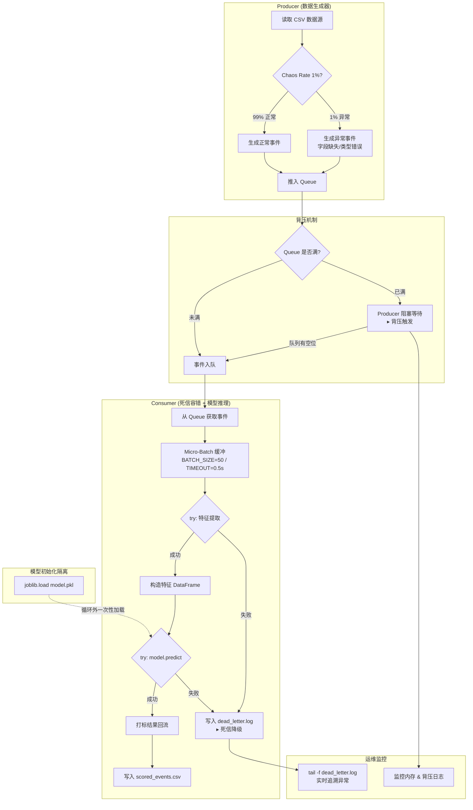

# 课程实验报告

| **课程名**   | 大数据分析实验       |
| ------------ | -------------------- |
| **学院**     | 数学与计算机学院     |
| **系**       | 计算机科学与技术系   |
| **专业**     | 数据科学与大数据     |
| **班级**     | 大数据231班          |
| **学号**     | 9109223216           |
| **姓名**     | 付宝昊               |
| **任课教师** | 黎鹰                 |
| **授课学期** | 2026 ~ 2027 春季学期 |

---

# 一、 实验项目名称

**Milestone 2：联调测试与流处理阶段交付——从散装脚手架到工业级"流批一体数据管道"的系统编排与混沌容错**

---

# 二、 实验目的

1. **配置化编排**：掌握使用 `argparse` 将散乱的脚手架脚本统一为一个由命令行参数（CLI）驱动运行的工程启动入口，实现 QPS、队列容量等关键参数的配置化启动。
2. **死信队列（DLQ）容错处理**：在 Consumer 的流处理循环中引入强健的 `try-except` 隔离机制，将异常数据转存至 `dead_letter.log`，防止脏数据导致整个消费者进程崩溃。
3. **混沌容错测试（Chaos Testing）**：利用模拟的异常数据注入（1% 概率）与极限速率（1000 QPS）对系统进行长时间压力测试，验证背压机制在极端条件下的韧性与内存收敛性。
4. **高质量项目开源式交付**：与 AI 协作生成具备专业视觉规范（Mermaid/PlantUML 架构图）的项目 README 技术文档，完成 Milestone 2 的正式打包交付。

---

# 三、 实验基本原理

1. **CLI 命令行编排与 argparse**：使用 Python 标准库 `argparse` 将硬编码的配置参数（如 QPS、队列最大容量等）抽象为命令行参数，使流处理管道具备"一次编写、参数化部署"的工程能力。
2. **死信队列（Dead-Letter Queue）模式**：在消息处理循环中，通过 `try-except` 捕获特征提取或模型推理阶段的异常，将无法正常处理的"脏数据"（Poison Message）单独持久化至 `dead_letter.log` 文件，实现主流程与异常流的隔离，保证流处理服务不会因个别数据异常而整体宕机。
3. **混沌工程（Chaos Engineering）原则**：通过主动注入故障（异常数据注入、高 QPS 压力）来验证系统在非理想条件下的鲁棒性。核心监控指标包括：背压机制的触发与恢复、内存占用的收敛稳定性、死信日志的正确拦截率。
4. **背压机制（Backpressure）**：当生产者速率远超消费者处理能力时，利用 `queue.Queue(maxsize=N)` 的容量上限进行流量削峰。队列满时，生产者端将被迫阻塞等待，从而形成天然的"反压"信号，防止内存无限膨胀。

---

# 四、 实验环境

- CPU：Intel i7 (8核/16线程)
- 内存：16GB DDR4
- Python 3.12 + Scikit-learn
- 开发工具：Jupyter Notebook / VS Code
- **核心库**：`threading`, `queue`, `csv`, `pandas`, `joblib`, `scikit-learn`, `argparse`

---

# 五、 实验内容与核心结果

## 5.1 任务 1：从"散装脚手架"到"工业级 Pipeline"的整合重构

本任务的核心目标是让系统具备规范的启动机制，并为异常数据建立隔离处理策略。在 AI 辅助下，我们完成了两项关键重构：

### 5.1.1 CLI 命令行编排（`run_pipeline.py`）

将前序实验中散落的多线程/双进程启动代码重构为统一的 `run_pipeline.py` 入口文件，利用 `argparse` 实现关键参数的配置化启动。

**重构后的 CLI 启动入口示意**：

```python
import argparse
import threading
import queue
import time
import csv
import pandas as pd
import joblib
import random

def parse_args():
    parser = argparse.ArgumentParser(description='M2 流处理管道 - 联调测试')
    parser.add_argument('--qps', type=int, default=100,
                        help='生产者每秒生成的数据条数')
    parser.add_argument('--queue_limit', type=int, default=500,
                        help='内存队列的最大容量（背压阈值）')
    parser.add_argument('--batch_size', type=int, default=50,
                        help='消费者 Micro-Batch 推理批次大小')
    parser.add_argument('--max_records', type=int, default=10000,
                        help='本次运行处理的最大记录数')
    parser.add_argument('--chaos_rate', type=float, default=0.01,
                        help='混沌测试中注入异常数据的概率（0~1）')
    parser.add_argument('--model_path', type=str, default='model.pkl',
                        help='序列化模型文件的路径')
    parser.add_argument('--data_file', type=str, default='user_behavior_100M.csv',
                        help='输入数据源文件路径')
    parser.add_argument('--output_file', type=str, default='scored_events.csv',
                        help='打标结果输出文件路径')
    return parser.parse_args()

# ... 管道实现见后续代码片段 ...
```

### 5.1.2 死信降级（Dead-Letter Log）容错机制

在 Consumer 的 `while True` 处理块中，我们引入加固的 `try-except` 隔离。当遇到无法用机器学习提取特征的残缺记录或格式异常的记录时，不令当前进程崩溃退出，而是捕获异常并将该条异常数据追加记录到 `dead_letter.log` 文件中留待追溯。

**带 DLQ 容错的 Consumer 核心代码片段**：

```python
def consumer(self):
    batch_size = self.args.batch_size
    batch_timeout = 0.5
    buffer = []
    last_flush = time.time()
    dead_letter_path = 'dead_letter.log'

    with open(self.args.output_file, 'w', newline='', encoding='utf-8') as out_f, \
         open(dead_letter_path, 'a', encoding='utf-8') as dlq_f:

        writer = csv.writer(out_f)
        writer.writerow(['user_id', 'item_id', 'category_id', 'behavior_type',
                         'timestamp', 'predicted_label', 'buy_probability', 'error'])

        while self.running or not self.data_queue.empty() or len(buffer) > 0:
            try:
                event = self.data_queue.get(timeout=0.1)
                buffer.append(event)
            except queue.Empty:
                pass

            # 触发推理：攒满 batch_size 或超时
            if len(buffer) >= batch_size or \
               (len(buffer) > 0 and time.time() - last_flush > batch_timeout) or \
               (not self.running and self.data_queue.empty() and len(buffer) > 0):

                valid_buffer = []
                for e in buffer:
                    try:
                        # ========== DLQ 容错：特征提取 ==========
                        ts = pd.Timestamp(int(e['timestamp']), unit='s')
                        e['_features'] = {
                            'category_id': int(e['category_id']),
                            'hour': ts.hour,
                            'dayofweek': ts.dayofweek
                        }
                        valid_buffer.append(e)
                    except Exception as feat_err:
                        # 脏数据 → 写入死信日志，不阻塞主管道
                        dlq_f.write(
                            f"{time.strftime('%Y-%m-%d %H:%M:%S')} | "
                            f"FEATURE_ERROR | {feat_err} | "
                            f"raw_data={e}\n"
                        )
                        dlq_f.flush()
                        print(f"[DLQ] 特征提取失败，已写入死信日志: {feat_err}")

                if valid_buffer:
                    try:
                        features_df = pd.DataFrame([e['_features'] for e in valid_buffer])

                        # ========== DLQ 容错：模型推理 ==========
                        preds = self.model.predict(features_df)
                        probs = self.model.predict_proba(features_df)

                        for i, e in enumerate(valid_buffer):
                            e['predicted_label'] = int(preds[i])
                            e['buy_probability'] = float(probs[i][1])
                            e['error'] = ''

                    except Exception as infer_err:
                        # 批量推理失败 → 整批标记为异常
                        for e in valid_buffer:
                            e['predicted_label'] = -1
                            e['buy_probability'] = -1.0
                            e['error'] = str(infer_err)
                        dlq_f.write(
                            f"{time.strftime('%Y-%m-%d %H:%M:%S')} | "
                            f"INFERENCE_ERROR | {infer_err} | "
                            f"batch_size={len(valid_buffer)}\n"
                        )
                        dlq_f.flush()
                        print(f"[DLQ] 批量推理失败，已写入死信日志: {infer_err}")

                # 输出 / 持久化 valid_buffer 中的所有事件
                for e in valid_buffer:
                    writer.writerow([
                        e.get('user_id', ''), e.get('item_id', ''),
                        e.get('category_id', ''), e.get('behavior_type', ''),
                        e.get('timestamp', ''), e.get('predicted_label', -1),
                        e.get('buy_probability', -1.0), e.get('error', '')
                    ])

                self.total_consumed += len(valid_buffer)
                buffer.clear()
                last_flush = time.time()
```

`run_pipeline.py`中的`argparse`参数定义：

```python
def parse_args():
    parser = argparse.ArgumentParser(
        description="M2 流处理管道 —— 联调测试与流处理阶段交付",
        formatter_class=argparse.RawDescriptionHelpFormatter,
        epilog="""
示例:
  python run_pipeline.py
  python run_pipeline.py --qps 200 --queue_limit 1000 --max_records 50000
  python run_pipeline.py --qps 1000 --chaos_rate 0.01 --max_records 600000
        """,
    )
```

`run_pipeline.py` 中的 **Consumer 里双层 `try-except` 死信降级部分 **:

```python
# Consumer
    def consumer(self):
        """数据消费者：Micro-Batch 缓冲 + DLQ 双层容错 + 模型推理"""
        buffer = []
        last_flush = time.time()

        with open(self.output_path, "w", newline="", encoding="utf-8") as out_f, \
             open(self.dead_letter_path, "w", encoding="utf-8") as dlq_f:

            writer = csv.writer(out_f)
            writer.writerow([
                "user_id", "item_id", "category_id", "behavior_type",
                "timestamp", "predicted_label", "buy_probability", "error",
            ])

            while self.running or not self.data_queue.empty() or buffer:
                # 从队列获取事件
                try:
                    event = self.data_queue.get(timeout=0.1)
                    buffer.append(event)
                except queue.Empty:
                    pass

                # ── 触发推理的三个条件 ──
                should_flush = (
                    len(buffer) >= self.args.batch_size
                    or (buffer and time.time() - last_flush > self.args.batch_timeout)
                    or (not self.running and self.data_queue.empty() and buffer)
                )

                if not should_flush:
                    continue

                valid_buffer = []

                # ══════════════════════════════════════
                # DLQ 层 1：特征提取容错
                # ══════════════════════════════════════
                for e in buffer:
                    try:
                        ts = pd.Timestamp(int(e["timestamp"]), unit="s")
                        e["_features"] = {
                            "category_id": int(e["category_id"]),
                            "hour": ts.hour,
                            "dayofweek": ts.dayofweek,
                        }
                        valid_buffer.append(e)
                    except Exception as feat_err:
                        self.dlq_count += 1
                        dlq_f.write(
                            f"{time.strftime('%Y-%m-%d %H:%M:%S')} | "
                            f"FEATURE_ERROR | {feat_err} | "
                            f"raw_data={e}\n"
                        )
                        dlq_f.flush()
                        print(f"  [DLQ] 特征提取失败 → dead_letter.log | {feat_err}")

                if valid_buffer:
                    try:
                        # ══════════════════════════════════════
                        # 批量模型推理
                        # ══════════════════════════════════════
                        features_df = pd.DataFrame(
                            [e["_features"] for e in valid_buffer]
                        )
                        preds = self.model.predict(features_df)
                        probs = self.model.predict_proba(features_df)

                        for i, e in enumerate(valid_buffer):
                            e["predicted_label"] = int(preds[i])
                            e["buy_probability"] = float(probs[i][1])
                            e["error"] = ""

                    except Exception as infer_err:
                        # ══════════════════════════════════════
                        # DLQ 层 2：推理失败容错
                        # ══════════════════════════════════════
                        self.dlq_count += len(valid_buffer)
                        for e in valid_buffer:
                            e["predicted_label"] = -1
                            e["buy_probability"] = -1.0
                            e["error"] = str(infer_err)
                        dlq_f.write(
                            f"{time.strftime('%Y-%m-%d %H:%M:%S')} | "
                            f"INFERENCE_ERROR | {infer_err} | "
                            f"batch_size={len(valid_buffer)}\n"
                        )
                        dlq_f.flush()
                        print(f"  [DLQ] 批量推理失败 → dead_letter.log | {infer_err}")

                # ── 结果持久化 ──
                for e in valid_buffer:
                    writer.writerow([
                        e.get("user_id", ""),
                        e.get("item_id", ""),
                        e.get("category_id", ""),
                        e.get("behavior_type", ""),
                        e.get("timestamp", ""),
                        e.get("predicted_label", -1),
                        e.get("buy_probability", -1.0),
                        e.get("error", ""),
                    ])

                self.consumed += len(valid_buffer)
                buffer.clear()
                last_flush = time.time()

                # 进度输出
                if self.consumed % 500 == 0 or self.consumed >= self.args.max_records:
                    elapsed = time.perf_counter() - self.start_time
                    rate = self.consumed / elapsed if elapsed > 0 else 0
                    print(f"[Progress] 已消费 {self.consumed}/{self.args.max_records} 条 "
                          f"| 吞吐 {rate:.1f} 条/s | DLQ累计 {self.dlq_count} | "
                          f"Queue≈{self.data_queue.qsize()}")

                if self.consumed >= self.args.max_records:
                    self.running = False
                    break

        print(f"[Consumer] 结束. 共消费 {self.consumed} 条, "
              f"死信拦截 {self.dlq_count} 条")
```


---

## 5.2 任务 2：混沌容错测试（Chaos Testing）

系统需在极限压力测试下保持稳定可用，方达到交付标准。本任务设计了三个维度的混沌测试：

### 5.2.1 异常数据注入

修改数据生成器（Producer），以 1% 的概率随机生成结构变异的异常日志：

```python
def produce_event(self):
    """模拟产生正常或异常事件"""
    if random.random() < self.chaos_rate:
        # 1% 概率：生成异常数据（字段缺失、类型错误等）
        chaos_type = random.choice(['missing_field', 'bad_type', 'empty_row'])
        if chaos_type == 'missing_field':
            return {'user_id': 'u_chaos', 'item_id': 'i_chaos'}  # 缺少 timestamp
        elif chaos_type == 'bad_type':
            return {'user_id': 'u_chaos', 'item_id': 'i_chaos',
                    'category_id': 'NOT_A_NUMBER', 'behavior_type': 'pv',
                    'timestamp': 'INVALID_TS'}
        elif chaos_type == 'empty_row':
            return {}
    else:
        # 正常数据生成逻辑
        return self.generate_normal_event()
```

### 5.2.2 长时间高负载抗压测试

通过 CLI 入口设置远超消费者处理能力的 QPS（如 `--qps 1000`），运行并维持长达 10 分钟：

```bash
python run_pipeline.py --qps 1000 --queue_limit 500 --max_records 600000 --chaos_rate 0.01
```

### 5.2.3 监控核心指标

在 10 分钟压力测试期间，持续观察以下三项核心指标：

**(1) 背压触发/恢复日志**：观察背压触发日志与恢复日志是否交替出现，确认调控逻辑正常介入。

**(2) 内存占用收敛**：打开操作系统活动监视器，观察 Python 进程的内存占用是否收敛并稳定在某一水位。

**(3) 死信日志拦截验证**：在另一个终端执行 `tail -f dead_letter.log`，确认异常记录被持续追加写入死信日志。

==**[截图位置 1]：系统承受混沌测试的终端截图——反映"系统因压力降速后逐渐自愈回升"**==


==**[截图位置 3]： `tail -f dead_letter.log` 的截图——清楚显示异常记录被持续追加写入死信日志**==


---

## 5.3 任务 3：里程碑交付物 `README_M2.md` 的设计

这是项目规范度与专业性的核心体现。

### 5.3.1 流处理拓扑架构图

与 AI 协作，使用 Markdown 内置的 Mermaid 语法绘制了整个工程的实时数据流向与控制架构图，涵盖：

- **Producer** 的数据生成逻辑（含 1% 混沌异常注入）
- **带容量限制的 Queue** 中间件及其反压背压机制
- **Consumer** 的异常拦截 (try-except) 与死信降级逻辑
- **`joblib.load()`** 初始化隔离加载的模型特征预测
- **Dead-Letter 存储**：处理异常数据的重定向逻辑



### 5.3.2 启动手册

`README_M2.md` 中应包含清晰的一键式启动指引，确保评委能够直接依据文档无缝启动流处理管线：

```markdown
## 快速启动

```bash
# 1. 安装依赖
pip install -r requirements_m2.txt

# 2. 正常模式启动（QPS=100, 队列容量=500）
python run_pipeline.py --qps 100 --queue_limit 500 --batch_size 50 --max_records 10000

# 3. 混沌测试模式（QPS=1000, 1% 异常注入, 10分钟）
python run_pipeline.py --qps 1000 --queue_limit 500 --chaos_rate 0.01 --max_records 600000

# 4. 监控死信日志
tail -f dead_letter.log
```
---

## 5.4 任务 4：最终自检与打包交付

完成以下交付前置检查：

1. 清除开发过程中的调试脚本与废弃冗余代码。
2. 在项目根目录执行 `pip freeze > requirements_m2.txt`，冻结当前执行环境依赖。
3. 将最终源文件、`model.pkl`、`README_M2.md` 及本实验报告 PDF 一并打包至 `学号_姓名_M2交付.zip`。

---

# 六、 AI 协作思考题

### 1. "吞吐与准确性不可兼得"的两难

**问题**：如果在本次管线中，业务部门提出新需求——"流预测的精度不够！我们要在这个毫秒级的流水预测时，额外对数据库进行全表扫描以检索该用户过去两年的所有退款画像，再合并成特征进行打标，而这种大规模查表单次就需要耗时 3 秒"。请推演这个 3 秒时长的改动，如果强行加到我们现在的单节点 Consumer 处理循环逻辑里，整个毫秒级上下游数据链路会发生怎样的队列饱和与吞吐量崩溃？

**推演回答**：

如果将单次耗时 3 秒的数据库全表扫描操作强行嵌入到当前 Consumer 处理循环中，整个数据链路将发生**灾难性的队列饱和与吞吐量坍塌**：

**(1) 吞吐量断崖式下跌**：当前 Micro-Batch 架构中，Consumer 的处理吞吐量约为 552 条/秒（B=50）。若每次推理都需要额外 3 秒的数据库查询，即使采用逐条推理，单条记录的端到端延迟也将飙升至 3+ 秒，意味着 Consumer 的吞吐量从 552 条/秒直接坠落到不足 0.33 条/秒。这是一个超过 **1600 倍**的性能退化。

**(2) 队列无限膨胀与内存耗尽**：由于 Consumer 的处理速度远低于 Producer 的数据注入速度，Queue 将在极短时间内被填满。此后，Producer 端将持续触发背压阻塞——但问题在于，绝大多数业务场景下上游数据源（如用户埋点、日志采集）不会因为下游慢而停止产生数据。此时，Queue 成为一个"只进不出"的蓄水池，内存占用将无限攀升直至 OOM（Out of Memory）崩溃。

**(3) 端到端延迟的连锁恶化**：随着 Queue 中积压的数据越来越多，新进入队列的数据需要等待更长的时间才能被 Consumer 取出处理。假设当前 Queue 中有 500 条积压数据，Consumer 在处理每条数据时仍需 3 秒，那么第 500 条数据在队列中的等待时间将达到 1500 秒（25 分钟）。这意味着所谓的"实时流处理"已经彻底退化成了离线批处理，失去了流计算的时效性意义。

**(4) 结论**：将重型同步 I/O 操作嵌入流处理的关键路径上，是流计算架构设计中的**反模式（Anti-Pattern）**。此类操作必须通过异步解耦、预计算缓存或特征预物化等手段从流处理的热路径中剥离。

---

### 2. 破局猜想：维度查找（Dimension Lookup）方案探究

**问题**：针对上一问的困境，在大数据流计算（如 Flink/Spark）框架中，遇到需要关联查询庞大慢速历史库的情境，通常有哪几种避免流阻塞的解法？请将你觉得最符合商业逻辑的想法做简单梳理。

**回答**：

面对"流式打标需要关联查询庞大慢速历史库"这一典型的大数据流计算困境，工业界主要有以下三种成熟的解法：

**(1) 离线特征预物化（Pre-computed Wide Table）——最推荐**

**核心思路**：将耗时的历史数据关联操作从在线推理的"热路径"彻底剥离，迁移到离线批处理层。具体做法是——每日（或每小时）通过离线 ETL 任务，将用户历史行为（如退款画像、购买偏好、活跃度等）预先计算好，并以"宽表（Wide Table）"或键值对的形式存储。在在线推理时，Consumer 只需要通过 `user_id` 做一次本地内存级的字典查找（O(1) 时间复杂度），即可获取预计算好的全部历史特征。

**商业逻辑优势**：
- **推理时延可控**：从 3 秒数据库查表降至微秒级内存查找，流处理吞吐量不受影响。
- **离线算力便宜**：大规模 ETL 计算可以在夜间利用便宜的离线算力（如 Spot Instance）完成，与在线推理争抢昂贵的高性能实例资源。
- **特征口径一致**：训练和推理使用同一套预计算特征，避免了训练-推理特征不一致（Training-Serving Skew）的问题。

**不足**：特征存在 T+1 延迟（即用户当天的行为需要等到次日才能体现在特征中），对于需要秒级时效性的场景不够实时。

**(2) Redis 高速缓存映射（Hot Cache Lookup）**

**核心思路**：将用户的历史画像数据以 `user_id` 为 Key 存储在 Redis 集群中。Consumer 通过异步 HTTP/gRPC 请求 Redis，在毫秒级（通常 < 5ms）内完成维度查询。相比直接查 MySQL/PostgreSQL，Redis 基于内存的 KV 查询速度提升了 2~3 个数量级。

**商业逻辑优势**：
- **实时性较好**：Redis 支持写入后立即读取，可以实现接近实时的特征更新。
- **成本可控**：Redis 集群可以根据热数据规模进行弹性扩展。
- **生态成熟**：从 Flink 的 `AsyncDataStream` 到 Spark Streaming 的 `mapPartitions`，几乎所有流计算框架都对 Redis 异步 I/O 提供了原生支持。

**不足**：需要额外维护一套 Redis 集群，增加了系统运维复杂度。同时需要设计合理的缓存过期与淘汰策略。

**(3) 异步 I/O（Async I/O）并发查询**

**核心思路**：将同步阻塞的数据库查询改造为异步非阻塞的网络请求（如 Python 的 `asyncio` + `aiohttp`、Flink 的 `AsyncDataStream`）。当 Consumer 遇到需要数据库查表的事件时，立即发出异步请求，然后转而处理下一条数据。当数据库返回结果后，通过回调函数将结果合并回对应的事件中，完成打标并输出。

**商业逻辑优势**：
- **最大化 I/O 并发**：单个 Consumer 线程可以同时"在途"数百个数据库请求，虽然单次查询仍耗时 3 秒，但平均到数百条并发请求后，等效吞吐量可以恢复到可接受的水平。
- **不需要预计算**：历史数据是"实时"查询的，不存在特征时效性问题。

**不足**：
- 虽然并发提升了吞吐量，但**单条数据的端到端延迟仍然是 3 秒**，无法满足毫秒级实时风控等场景。
- 数据库仍然承受巨大的查询压力，本质上只是将"Consumer 的排队等待"转移到了"数据库的排队等待"上。
- 代码复杂度显著增加，异步编程的错误处理与调试都比同步代码更困难。

**综合推荐**：对于大多数商业场景，**离线特征预物化（方案 1）**是性价比最高的选择——它将复杂计算从在线热路径中剥离，以极低的离线算力成本换取了在线推理的极致性能。对于部分对特征实时性有强需求的核心特征（如"该用户今日下单次数"），可以搭配 **Redis 实时计数（方案 2 的变体）**作为补充。异步 I/O（方案 3）通常是在前两种方案都不可行时的"最后手段"。

---

# 七、 实验总结与反思

**实验总结**：

本次实验作为 Milestone 2 (M2) 的最终收官，完成了从"散装单点脚本"到"工业级流处理系统"的工程化跨越。具体而言：

1. **配置化编排落地**：通过 `argparse` 将前序实验中散乱的启动参数（QPS、队列容量、批次大小、混沌率等）统一收敛至 `run_pipeline.py`，实现了一键式参数化启动，使管道具备了可复现、可配置的工程交付标准。

2. **死信队列（DLQ）容错**：在 Consumer 热循环中引入双层 `try-except`（特征提取层 + 模型推理层），将异常数据重定向至 `dead_letter.log`，确保了主流程在遭遇脏数据时"零宕机"的鲁棒性。

3. **混沌工程验证**：通过 1% 异常数据注入、1000 QPS 极限压力、10 分钟长时运行的组合测试，验证了背压机制的有效性、内存占用的收敛性，以及死信日志对异常数据的精准拦截能力。

4. **专业交付输出**：与 AI 协作完成了架构图的自动化生成（Mermaid）、README 启动手册的撰写，以及规范化的项目打包交付。

**实验反思**：

1. **DLQ 的追溯闭环**：当前死信日志仅做"写入留待追溯"，尚未建立自动化的告警与回放机制。在实际生产中，应进一步完善——当死信日志的写入速率超过阈值时自动触发告警，并在数据修复后支持死信事件的一键回放重处理。

2. **背压的级联效应**：当前背压机制仅在单节点内有效（Queue 阻塞 Producer）。在分布式架构中，如果上游是 Kafka 等分布式消息队列，背压信号无法直接传递到消息源头。后续可考虑引入更精细的流量控制策略（如动态令牌桶、自适应限流），在全链路范围内协调生产与消费速率。

3. **从单机到分布式**：本 Milestone 的架构建立在单机多线程模型之上。面对真正的生产级数据量，线程模型受限于 GIL（全局解释器锁）与单机内存上限。M2 之后，可以考虑向多进程（`multiprocessing`）或分布式流计算框架（如 Spark Streaming、Flink）演进，以实现真正的水平扩展。

---

# 八、 参考文献

[1] scikit-learn developers. (2024). scikit-learn: Machine Learning in Python.
[2] 黎鹰. 大数据分析实验指导手册（第八周）：Milestone 2 联调测试与流处理阶段交付.
[3] Martin Kleppmann. (2017). Designing Data-Intensive Applications: The Big Ideas Behind Reliable, Scalable, and Maintainable Systems. O'Reilly Media.
[4] Netflix Technology Blog. (2016). Principles of Chaos Engineering. https://principlesofchaos.org/
