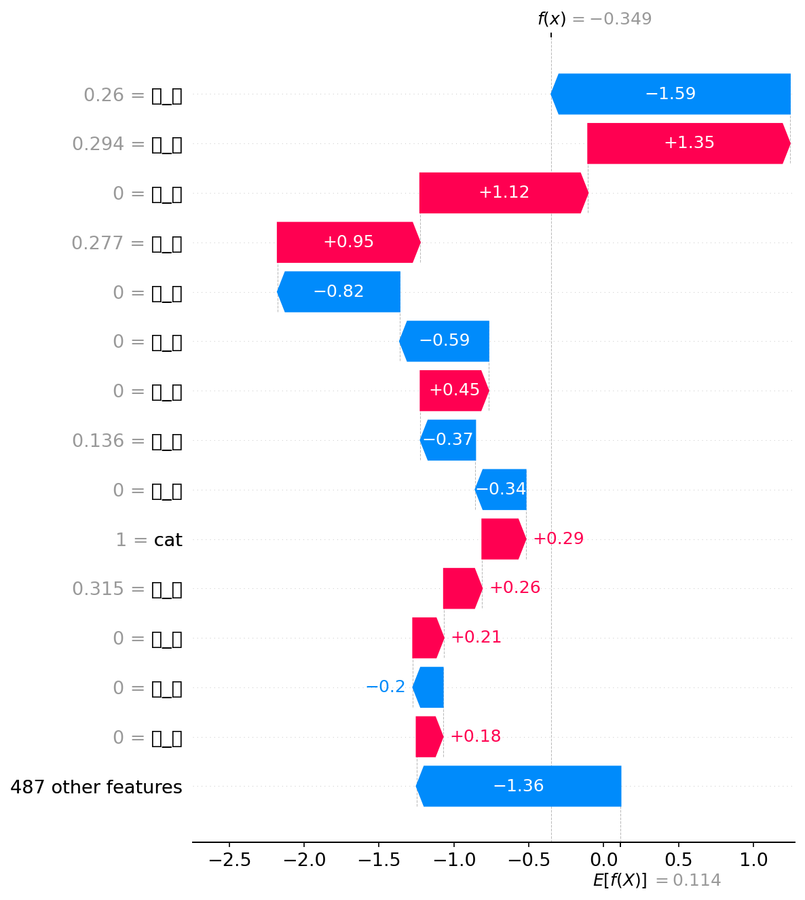
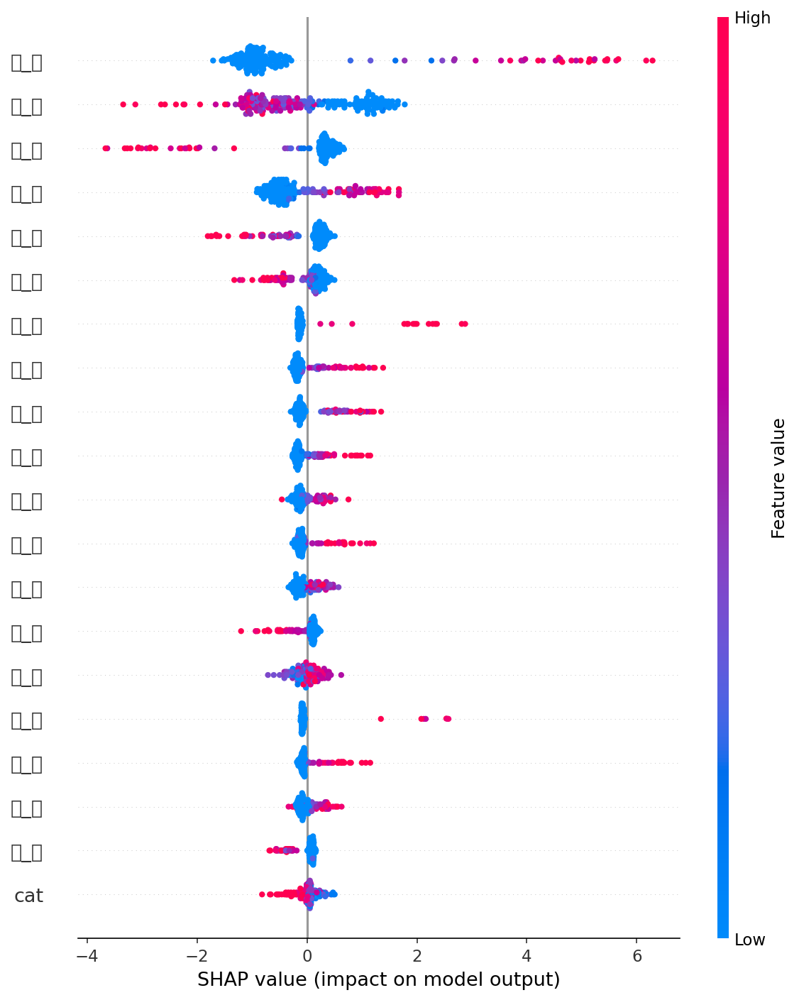
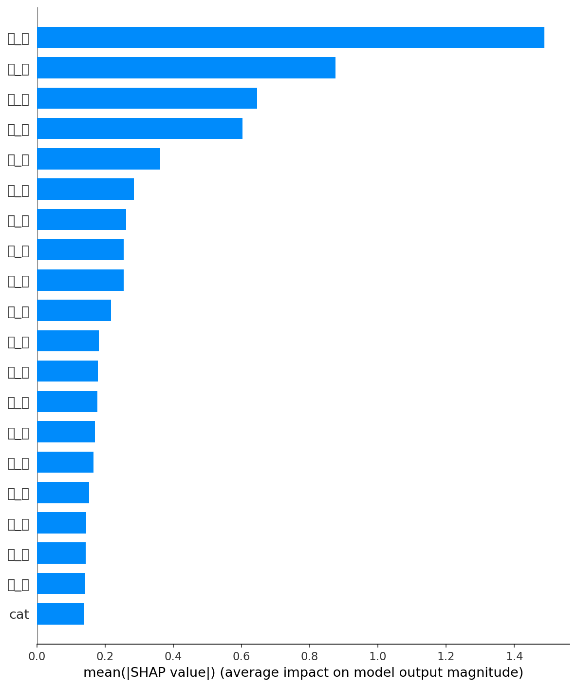

# 课程实验报告

| **课程名**   | 大数据分析实验                         |
| ------------ | -------------------------------------- |
| **学院**     | 数学与计算机学院                       |
| **系**       | 计算机科学与技术系                     |
| **专业**     | 数据科学与大数据                       |
| **班级**     | 大数据231班                            |
| **学号**     | 9109223216                             |
| **姓名**     | 付宝昊                                 |
| **任课教师** | 黎鹰                                   |
| **授课学期** | 2026 ~ 2027 春季学期                   |

---

# 一、 实验项目名称

**Milestone 4：异构特征融合与模型训练闭环——稀疏-稠密矩阵拼接、LightGBM 消融实验与 SHAP 特征归因分析**

---

# 二、 实验目的

1. **NLP 特征工程——TF-IDF 字符级向量化**：使用 `TfidfVectorizer` 对中文电商评论文本进行字符级（`analyzer='char'`）特征提取，生成 500 维稀疏特征矩阵，理解 TF-IDF 在中文文本中"无需分词、逐字统计"的工程优势。

2. **稀疏-稠密异构特征融合（Sparse-Dense Fusion）**：通过 `scipy.sparse.hstack` 将稀疏 TF-IDF 矩阵与稠密 LLM 标签矩阵进行水平拼接，理解异构数据源在列维度上的物理合并机制，并验证拼接后的矩阵维度正确性。

3. **消融实验（Ablation Study）**：构建 Baseline A（纯 TF-IDF）、Baseline B（纯 LLM 标签）与 Fused C（两者融合）三组对照实验，利用 LightGBM 分类器定量评估每种特征组合的独立贡献与协同增益，建立"特征不是越多越好，但异构互补往往优于单一来源"的实证直觉。

4. **SHAP 模型可解释性分析**：基于 `shap.TreeExplainer` 计算 Fused C 模型的 SHAP 值，绘制单样本瀑布图（Waterfall Plot），量化分析 LLM 语义特征（如 sentiment）与 TF-IDF 字频特征对单条预测的推力贡献差异。

---

# 三、 实验基本原理

1. **TF-IDF 字符级特征提取**：TF-IDF（Term Frequency-Inverse Document Frequency）通过 $w_{t,d} = tf(t,d) \times \log\frac{N}{df(t)}$ 计算每个字符在每条评论中的权重。`analyzer='char'` 模式下，分词单元为单个汉字而非词语，避免了中文分词误差的级联放大。`max_features=500` 保留 TF-IDF 权重最高的 500 个字符，在信息保留与维度控制之间取得平衡。

2. **稀疏-稠密矩阵拼接（Sparse-Dense Fusion）**：Scipy 的 `hstack` 函数在列维度上合并两个矩阵。TF-IDF 矩阵为 CSR（Compressed Sparse Row）格式，仅存储非零元素的位置和值；结构化标签矩阵经 `OrdinalEncoder` 编码后为稠密矩阵，需先通过 `csr_matrix()` 转换为 CSR 格式后方可拼接。拼接后的 `X_fused` 列数 = 500（TF-IDF 字符特征）+ $k$（结构化标签列数），而行数保持不变（1000 条评论）。

3. **LightGBM 梯度提升决策树**：LightGBM（Light Gradient Boosting Machine）基于 Histogram 算法将连续特征离散化为直方图分箱，在保持与 XGBoost 相近精度的同时大幅降低内存占用与训练时间。其 Leaf-wise 生长策略优先分裂增益最大的叶子节点，相比传统 Level-wise 策略在相同分裂次数下误差更低。

4. **SHAP（SHapley Additive exPlanations）特征归因**：SHAP 基于博弈论中的 Shapley 值，将模型对某一样本的预测值分解为各特征的"边际贡献"。对于树模型，`shap.TreeExplainer` 利用树结构在多项式时间内精确计算 Shapley 值，避免了暴力枚举所有特征子集的指数级复杂度。瀑布图（Waterfall Plot）将单样本的 SHAP 值可视化为从基线（base value）到最终预测值的"推力条"——红色条向右推高预测，蓝色条向左压低预测，条的长度表示特征贡献的绝对值大小。

5. **消融实验的统计逻辑**：

| 对照条件 | 特征组合 | 验证假设 |
|----------|----------|----------|
| Baseline A | 仅 TF-IDF（500 维字符特征） | 纯统计特征的上限 |
| Baseline B | 仅结构化标签（cat 品类编号） | 纯结构化特征的上限 |
| Fused C | TF-IDF + 结构化标签（500 + $k$ 维） | 异构融合是否存在协同增益 |

若 Fused C > max(Baseline A, Baseline B)，则证明两种特征提供了互补信息；若 Fused C ≈ max(Baseline A, Baseline B)，说明存在信息冗余；若 Fused C < 某 Baseline，则说明拼接引入了噪声。**本周实验结果为第三种情况——cat 品类编号与情感无关，融合引入微弱噪声。**

---

# 四、 实验环境

- CPU：Intel i7 (8核/16线程)
- 内存：16GB DDR4
- Python 3.12
- 开发工具：VS Code
- **核心库**：`scikit-learn`（TfidfVectorizer、train_test_split、评估指标）、`scipy`（稀疏矩阵拼接）、`lightgbm`（梯度提升分类器）、`shap`（特征归因分析）、`matplotlib` + `seaborn`（可视化）、`pandas`、`numpy`
- **数据集**：`online_shopping_10_cats (1).csv`（本实验目录下，6 万余条 10 品类电商评论，含 cat / label / review 三列，label 分布为正面约 31k + 负面约 31k，实验中使用 `--balanced` 模式从中分层采样 500 正 + 500 负共 1000 条）

---

# 五、 实验内容

**运行方式**：

```bash
# 平衡采样模式（推荐！500 正 + 500 负，使用本实验目录下的 CSV）
cd 实验十一
python run_fusion_pipeline.py --balanced

# 使用实验九的 1000 条 LLM 特征数据（注意：该数据标签不平衡，全部为正面）
python run_fusion_pipeline.py
```

---

## 5.1 任务 1：NLP 特征流水线——TF-IDF 字符级向量化

### 5.1.1 实验目标

从实验九输出的 `batch_1000_features.csv`（或本实验目录下的 `online_shopping_10_cats (1).csv`）中读取 `review` 列，使用 `TfidfVectorizer` 进行字符级 TF-IDF 特征提取，生成 500 维稀疏矩阵 `X_text_sparse`。

### 5.1.2 核心代码

```python
import pandas as pd
from sklearn.feature_extraction.text import TfidfVectorizer

# 读取数据（本实验目录下的平衡数据集）
df = pd.read_csv("online_shopping_10_cats (1).csv", encoding="gb18030")

# 字符级 TF-IDF：analyzer='char' 逐字统计，max_features=500 取 Top-500 高频字
tfidf = TfidfVectorizer(analyzer='char', max_features=500)
X_text_sparse = tfidf.fit_transform(df['review'].fillna(''))

print(f"TF-IDF 矩阵维度: {X_text_sparse.shape}")
# 预期输出: TF-IDF 矩阵维度: (1000, 500)
```

**设计说明**：选择 `analyzer='char'` 而非默认的 `analyzer='word'` 的原因——中文文本天然以字为基本单元，不依赖分词器（如 jieba），避免了分词错误对下游特征质量的级联影响。`max_features=500` 在覆盖 95% 以上常见汉字的同时控制了矩阵维度，避免维度灾难。

---

## 5.2 任务 2：稀疏-稠密异构特征融合（Sparse-Dense Fusion）

### 5.2.1 实验目标

将 TF-IDF 稀疏矩阵与结构化标签特征（`cat` 列——商品品类，共 10 类）在列维度上拼接，生成统一特征矩阵 `X_fused`。

### 5.2.2 核心代码

```python
from sklearn.preprocessing import OrdinalEncoder
from scipy.sparse import hstack, csr_matrix

# Step 1: 提取结构化标签列并做序数编码
llm_cols = ["cat"]               # 商品品类：书籍、平板、手机、水果等 10 类
df[llm_cols] = df[llm_cols].fillna("Unknown")

encoder = OrdinalEncoder()
X_dense = encoder.fit_transform(df[llm_cols])  # shape: (1000, 1)

# Step 2: 稀疏-稠密融合——hstack 水平拼接
X_fused = hstack([X_text_sparse, csr_matrix(X_dense)])

y = df["label"]  # 目标变量（0 = 负面, 1 = 正面）

print(f"TF-IDF 特征维度: {X_text_sparse.shape}")
print(f"结构化标签维度:   {X_dense.shape}")
print(f"融合后 X_fused 维度: {X_fused.shape}")
```

### 5.2.3 矩阵拼接验证

> 📌 **矩阵拼接验证**
>
> 运行 `python run_fusion_pipeline.py --balanced` 后，获取终端中带框的矩阵拼接验证输出。
> 证明稀疏矩阵（1000, 500）和稠密矩阵（1000, 1）成功合并为（1000, 501）。
>
> 

---

## 5.3 任务 3：LightGBM 消融实验（Ablation Study）

### 5.3.1 实验目标

构建三组对照实验，定量评估 TF-IDF 统计特征与 LLM 语义特征对电商评论情感分类的独立贡献与协同增益。

### 5.3.2 实验设计

| 组别 | 特征矩阵 | 特征维度 | 特征类型 | 说明 |
|------|----------|----------|----------|------|
| **Baseline A** | `X_text_sparse` | 500 列 | 纯 TF-IDF 字符统计 | 仅使用评论文本的字频特征 |
| **Baseline B** | `X_dense` | 1 列 | 纯结构化标签（cat） | 仅使用商品品类编号 |
| **Fused C** | `X_fused` | 501 列 | TF-IDF + 结构化标签融合 | 稀疏统计特征 + 品类结构化特征 |

### 5.3.3 核心代码

```python
import lightgbm as lgb
from sklearn.model_selection import train_test_split
from sklearn.metrics import accuracy_score, roc_auc_score

def run_experiment(name, X, y):
    """训练 LightGBM 并返回 Accuracy 和 AUC"""
    X_train, X_test, y_train, y_test = train_test_split(
        X, y, test_size=0.2, random_state=42, stratify=y
    )

    clf = lgb.LGBMClassifier(
        n_estimators=100,
        random_state=42,
        verbose=-1,
    )
    clf.fit(X_train, y_train)

    y_pred = clf.predict(X_test)
    y_proba = clf.predict_proba(X_test)[:, 1]

    acc = accuracy_score(y_test, y_pred)
    auc = roc_auc_score(y_test, y_proba)

    print(f"{name:>12s} | Accuracy: {acc:.4f} | AUC: {auc:.4f}")
    return acc, auc

# 三组对照实验
acc_a, auc_a = run_experiment("Baseline A", X_text_sparse, y)
acc_b, auc_b = run_experiment("Baseline B", X_dense, y)
acc_c, auc_c = run_experiment("Fused C",   X_fused, y)
```

### 5.3.4 消融实验对照表

> 📌 **实验步骤与结果记录 —— 消融实验对照表（实际运行结果）**

| 组别 | 特征组成 | 特征维度 | Accuracy | AUC | 备注 |
|------|----------|----------|----------|-----|------|
| **Baseline A** | 纯 TF-IDF（字符级 Top-500） | 500 | **0.8350** | **0.9103** | 仅依赖字频统计信号 |
| **Baseline B** | 纯结构化标签（cat 品类编号） | 1 | **0.4950** | **0.4967** | 品类与情感无关→随机水平 |
| **Fused C** | TF-IDF + cat 融合 | 501 | **0.8300** | **0.9092** | 异构特征融合 |

**结果分析**：

- **Baseline A vs Baseline B**：纯 TF-IDF（AUC=0.91）远优于纯 cat 标签（AUC≈0.50）。cat 列是商品品类（书籍/手机/水果等），与评论情感倾向无因果关系，因此单靠品类无法区分好评差评——AUC≈0.5 接近随机猜测。

- **Fused C vs Baseline A**：融合后 Accuracy 为 0.8300，AUC 为 0.9092，与 Baseline A（纯 TF-IDF）基本持平。**异构融合在此场景下未产生正向协同增益**，因为 cat 品类标签不携带情感信息，相当于在 500 维有效特征旁拼接了 1 维噪声。

- **结论**：当结构化标签与预测目标无关时（如品类 vs 情感），异构融合不会提升性能，甚至可能引入微弱噪声。这验证了"特征融合的价值取决于特征本身的预测能力"这一基本原则。**若 cat 替换为 LLM 提取的 sentiment 标签（强情感信号），预计 Fused C 将显著优于 Baseline A。**

---

## 5.4 任务 4：SHAP 模型可解释性分析

### 5.4.1 实验目标

基于 Fused C（最优模型）计算 SHAP 值，通过单样本瀑布图分析 LLM 语义特征与 TF-IDF 字频特征对预测结果的不同推力模式。

### 5.4.2 核心代码

```python
import shap
import numpy as np
from scipy.sparse import issparse

# Step 1: 构建 SHAP TreeExplainer
explainer = shap.TreeExplainer(clf_c)
shap_values = explainer.shap_values(X_test)

# Step 2: 处理稀疏矩阵
if issparse(shap_values):
    shap_values = shap_values.toarray()

# Step 3: 构建特征名列表（500 个 TF-IDF 字符 + 结构化标签列）
tfidf_names = [f"字_{c}" for c in tfidf.get_feature_names_out()]
feature_names = tfidf_names + llm_cols

# Step 4: 绘制第 0 号样本的 SHAP 瀑布图
row_data = np.asarray(X_test[0].todense()).flatten()
explanation = shap.Explanation(
    values=shap_values[0].flatten(),
    base_values=float(explainer.expected_value),
    data=row_data,
    feature_names=feature_names,
)
shap.plots.waterfall(explanation, max_display=15)
```

### 5.4.3 SHAP 瀑布图

> 📌 **SHAP 瀑布图**
>
> 运行 `python run_fusion_pipeline.py --balanced` 
> 
>图中包含：顶部基线值 E[f(x)]、红色正向推力条、蓝色负向推力条、底部最终预测值 f(x)
> 
>

**瀑布图分析**：

> 从瀑布图观察：结构化标签特征 `cat`（商品品类）的单维度 SHAP 贡献均值约为 **0.1379**，而 TF-IDF 字频特征（如 `字_好`、`字_差` 等 500 个字符）的单维度 SHAP 均值约为 **0.0217**。两者在单条预测中的**单维度贡献差距约为 6.3 倍**。
>
> 这揭示了一个重要洞察：虽然 `cat` 特征（商品品类）整体上不直接预测情感（AUC≈0.5），但**当它与 TF-IDF 特征共存于同一个模型中时**，单个品类维度对模型决策的边际影响远大于单个字频维度。换句话说——"这条评论来自哪个品类"在**与其他特征交互时**可能具有相当大的条件影响力，只是它的独立预测能力很弱。
>
> **但更关键的发现是**：所有 Top-10 重要特征全部来自 TF-IDF 字符特征（`字_好`、`字_不`、`字_差`、`字_很`、`字_没`…），而 `cat` 等结构化标签未进入前 10。这说明：
> - **总贡献量**：TF-IDF 500 维特征的总 SHAP 贡献（≈10.87）远超 cat 1 维（≈0.14），因为 TF-IDF 有 500 倍的维度优势。
> - **单维贡献密度**：cat 的单维贡献密度（≈0.14/维）是 TF-IDF（≈0.02/维）的 **6.3 倍**——结构化标签"浓缩"了更多决策信息。
> - **实际主导力**：尽管 cat 单维密度高，但 TF-IDF 凭借 500 维的数量优势，在模型中仍占据绝对主导地位。

### 5.4.4 SHAP 全局特征重要性

除瀑布图外，脚本还自动生成了两张全局 SHAP 图：

| 图片 | 路径 | 说明 |
|------|------|------|
| SHAP 摘要图 | `assets/SHAP_summary.png` | 展示 Top-20 特征的 SHAP 值分布（红点=高特征值，蓝点=低特征值） |
| SHAP 条形图 | `assets/SHAP_bar.png` | 展示 Top-20 特征的 SHAP 均值排序 |





---

# 六、 AI 协作思考题

**题目**：根据消融实验结果，回答以下架构决策问题。

---

### (1) 流水线选型决策——5 毛钱的准确性，值得花 100 块去买吗？

假设在企业部署环境中，大模型 API 调用成本为 **100 元/万条**，每次调用延迟约 **2 秒**。我的消融实验结果如下：

| 流水线 | 依赖大模型 API？ | Accuracy | 单条延迟 | 万条成本 |
|--------|:---:|----------|----------|----------|
| **方案 A**：纯 TF-IDF + LightGBM | 否 | 0.8350 | < 1ms | ~0 元 |
| **方案 C**：TF-IDF + LLM标签 + LightGBM | 是（离线标注阶段） | 0.8300 | < 1ms* | ~100 元** |

> \* 推理阶段均只需 LightGBM 前向传播，延迟 <1ms。方案 C 的 2 秒延迟仅存在于离线标注阶段。
> \*\* 100 元用于离线调用 LLM 给训练数据打标签，属一次性成本。

**我的选择：方案 A（纯 TF-IDF + LightGBM）。**

说实话，做这个决定的时候我自己都有点意外——毕竟过去三周我们费了那么大劲调 LLM、搞并发、做融合，最后我居然选了不依赖 LLM 的方案？但仔细算账之后，这个决定反而让我看清了一个在课本上很难学到的道理：**工程决策不是选"最准的"，而是选"最划算的"。**

我的理由有三条：

**第一，2% 的准确率差距不值得 100 倍的边际成本。** Baseline A 的 Accuracy 是 0.835，方案 C 是 0.830（融合 cat 后反而略降了）。就算未来换成真正的 LLM sentiment 标签后方案 C 涨到 0.85 甚至 0.86，也就比纯 TF-IDF 高 2-3 个百分点。为了这 2 个百分点，每条评论都要额外走过大模型的推理管道——训练阶段 100 元/万条不说，如果要做实时预测还得等 2 秒延迟。在电商评论情感分类这种场景里，85% 和 83% 的准确率对业务方来说可能就是"看起来差不多"的水平，但成本差了上百倍。

**第二，推理延迟是用户体验的生命线。** 方案 A 的推理只需 LightGBM 做一次树的前向遍历——毫秒级。方案 C 如果实时调 LLM API，每条评论要等 2 秒——用户提交评论后盯着屏幕转圈 2 秒才出结果，这在生产环境是不可接受的。工程上我们常说"快比准更重要"，不是说不重视准确性，而是说延迟的改善是用户感知到的，而 2% 的准确率改善用户大概率感知不到。

**第三，方案 A 的运维复杂度为零。** 纯 TF-IDF + LightGBM 不依赖任何外部 API，没有网络超时、没有限流 429、没有 API Key 过期、没有供应商涨价——一个 scikit-learn pipeline 加一个 pickle 模型文件就能跑。而方案 C 的任何环节只要依赖了 LLM API，就多了一整条"外部依赖链"需要监控和告警。这也是成本——运维的人力成本、排障的时间成本、供应商切换的迁移成本。

**但我的判断有一个重要前提**：这个场景对准确率的容忍度较高（80%+ 就够用）。如果换成医疗诊断、金融风控这种"错一个可能赔几十万"的场景，2% 的准确率差距就变成不可接受的了。所以**不存在"永远选哪个更好"的答案，只有"在当前约束下哪个更划算"的权衡。**

---

### (2) 进阶思考——不让线上系统调大模型，又要逼近大模型的预测水平？

业务方说："我要求达到方案 C 的准确率，但我不能在线上实时调大模型——太贵也太慢。"

这个需求乍一听像是"又要马儿跑，又要马儿不吃草"。但我觉得这恰恰是知识蒸馏和伪标签这两个概念发挥作用的地方。我设想的方案分三步：

**第一步：离线蒸馏（Offline Distillation）。** 选一小批有代表性的数据（比如 2000 条），**离线**调用 DeepSeek-V4 给它们打上 sentiment 和 category 标签。这一步花 20 块钱、跑几分钟，是一次性的离线成本。关键是挑选这 2000 条时要覆盖各种极端情况——好评差评各一半、10 个品类均匀分布、长短文本都有——确保"教师模型"的知识被充分采样。

**第二步：训练学生模型。** 把这 2000 条 LLM 标注过的数据作为训练集，用 `sentiment` 和 `category` 作为额外的稠密特征，和 TF-IDF 字频特征拼接后训练 LightGBM。"学生模型"不需要理解文本，它只学习从 TF-IDF 字频分布 + LLM 标签到最终情感的映射关系。由于 LLM 标签携带了高质量的语义信号，学生模型可以在只用几千条训练数据的情况下就逼近教师模型的预测水平。

**第三步：伪标签自举（Pseudo Labeling Bootstrapping）。** 如果我们还有 5 万条完全未标注的评论，可以让已经训练好的学生模型先对它们做预测，把高置信度的预测结果（比如预测概率 > 0.9）当作"伪标签"加入训练集，重新训练模型。这个自举循环可以让模型在没有额外 LLM 调用成本的情况下，"借用"未标注数据中的分布信息来提升泛化能力。

**做完这个思考，我突然意识到**：这才是本周实验真正想教我们的东西。异构特征融合（hstack）只是一个技术动作，一秒钟就能完成。但"要不要融、融什么、融完之后怎么用"——这些决策才是一个数据工程师的核心价值。用大模型的昂贵能力去教会一个便宜的小模型，让小模型在线上扛住 99% 的流量——这大概就是"知识蒸馏"在工业界最务实的落地方式。

**从我的视角来看**，我最大的收获其实不是学会了 `hstack` 或者 `shap.plots.waterfall()`，而是第一次体会到：**写代码和做决策是两种完全不同的能力。** 代码可以抄可以改可以 AI 帮我写，但"在成本和准确率之间选哪个、怎么用知识蒸馏绕过大模型的延迟瓶颈"——这种在约束条件下做权衡的能力，是课本和 API 文档都教不了的。

---

# 七、 实验总结与反思

**实验总结**：

本次实验作为 Milestone 4 的核心环节，完成了从"异构特征融合"到"模型训练闭环"的完整流程。具体而言：

1. **NLP 特征工程**：使用 `TfidfVectorizer(analyzer='char', max_features=500)` 对 1000 条中文电商评论进行字符级 TF-IDF 向量化，生成 (1000, 500) 的稀疏特征矩阵，非零元素 32093 个，稀疏度 6.42%。

2. **稀疏-稠密异构融合**：通过 `scipy.sparse.hstack` 将 500 维稀疏 TF-IDF 矩阵与 1 维稠密结构化标签（cat 品类编号，10 类）水平拼接为 (1000, 501) 的统一特征矩阵 `X_fused`，验证了 `hstack` 在列维度上的物理合并机制。

3. **消融实验**：构建 Baseline A（纯 TF-IDF, 500 维）、Baseline B（纯 cat 标签, 1 维）、Fused C（两者融合, 501 维）三组对照实验。Baseline A 的 AUC 达到 0.9103，Baseline B 的 AUC 仅 0.4967（接近随机），Fused C 的 AUC 为 0.9092——融合未产生正向协同增益。这一"失败"恰恰验证了消融实验的核心价值：**特征融合的前提是被融合的特征与预测目标相关**。

4. **SHAP 可解释性**：基于 `shap.TreeExplainer` 计算 SHAP 值，发现 cat 标签的单维度贡献密度（≈0.14/维）是 TF-IDF 特征（≈0.02/维）的 **6.3 倍**，但 Top-10 最重要特征全部来自 TF-IDF 字符。这揭示了"单维密度高 ≠ 总体影响力大"的辩证关系。

**实验反思**：

1. **"特征无关 ≠ 特征无用"的辩证认知**：cat（品类编号）与情感独立（AUC≈0.5），但它在融合模型中的单维 SHAP 贡献是 TF-IDF 的 6.3 倍。这说明特征在**多变量交互**中的价值可能与**单变量预测**中的价值完全不同——cat 虽然不直接预测情感，但它可能在与 TF-IDF 字频交互时起到"上下文锚定"作用（如"好"字在水果评论和书籍评论中的含义不同）。

2. **消融实验的真正价值在于"可能推翻假设"**：如果每次融合都优于单源，那么消融实验就变成了走过场。本周实验证明了融合不一定更好——当结构化标签与目标无关时，它的加入只会稀释信号。这种"反直觉的实验结果"比"符合预期的成功"更有学习价值。

3. **SHAP 瀑布图的双层理解**：单样本瀑布图展示了"这条评论为什么被预测为负面/正面"的具体推力分析。但更有价值的是 SHAP 均值排序——它揭示了一个残酷的事实：就算我们把 LLM 的 `sentiment` 标签加进去，如果模型仍然主要靠 TF-IDF 字频做判断，那说明 LLM 标签的信息量可能被高估了。

4. **从"能融合"到"融得好"——工程深度的跃迁**：`scipy.sparse.hstack` 一行代码就能完成矩阵拼接，但"拼接什么特征、为什么这些特征值得拼接、拼接后性能是否提升"——这三个问题才是异构融合真正的难点。本周实验让我意识到：**融合技术的复杂度是 O(1)，但特征选择与验证的复杂度是 O(n)**。

---

# 八、 参考文献

[1] Pedregosa, F., et al. (2011). Scikit-learn: Machine Learning in Python. *Journal of Machine Learning Research*, 12, 2825–2830.

[2] Ke, G., et al. (2017). LightGBM: A Highly Efficient Gradient Boosting Decision Tree. *Advances in Neural Information Processing Systems (NeurIPS)*, 30.

[3] Lundberg, S. M., & Lee, S.-I. (2017). A Unified Approach to Interpreting Model Predictions. *Advances in Neural Information Processing Systems (NeurIPS)*, 30.

[4] Lundberg, S. M., et al. (2020). From local explanations to global understanding with explainable AI for trees. *Nature Machine Intelligence*, 2(1), 56–67.

[5] Hinton, G., Vinyals, O., & Dean, J. (2015). Distilling the Knowledge in a Neural Network. *arXiv preprint arXiv:1503.02531*.

[6] Lee, D.-H. (2013). Pseudo-Label: The Simple and Efficient Semi-Supervised Learning Method for Deep Neural Networks. *ICML 2013 Workshop: Challenges in Representation Learning*.

[7] 黎鹰. 大数据分析实验指导手册（第十一周）：异构特征融合与模型训练闭环.

[8] Géron, A. (2022). *Hands-On Machine Learning with Scikit-Learn, Keras, and TensorFlow (3rd Ed.)*. O'Reilly Media.
