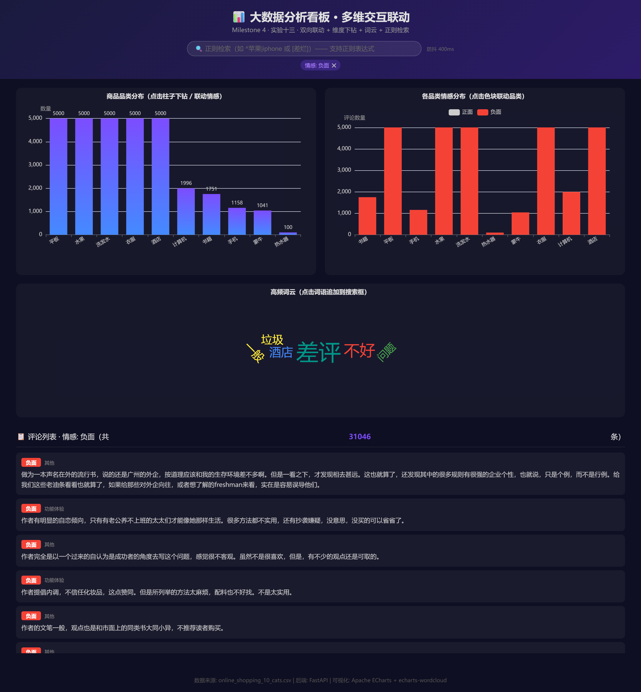
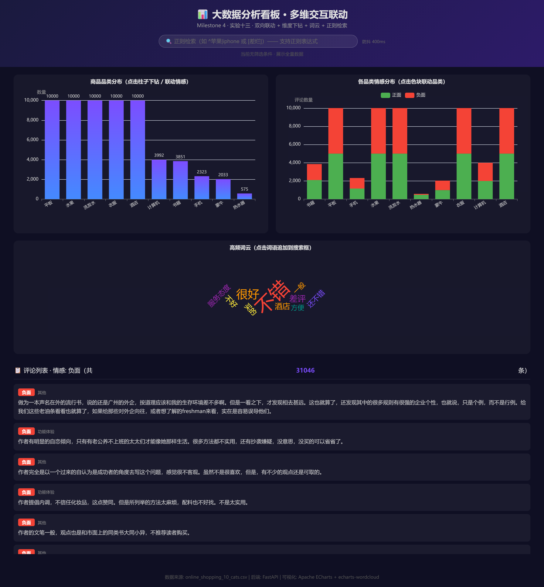
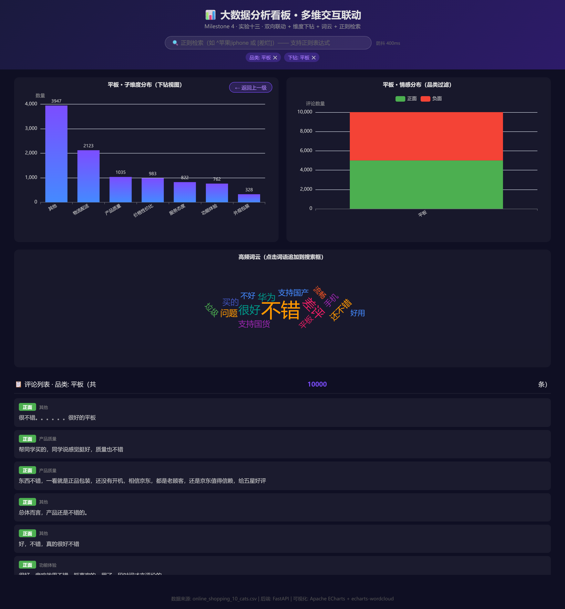

# 课程实验报告

| **课程名**   | 大数据分析实验                         |
| ------------ | -------------------------------------- |
| **学院**     | 数学与计算机学院                       |
| **系**       | 计算机科学与技术系                     |
| **专业**     | 数据科学与大数据                       |
| **班级**     | 大数据231班                            |
| **学号**     | 9109223216                             |
| **姓名**     | 付宝昊                                 |
| **任课教师** | 黎鹰                                   |
| **授课学期** | 2026 ~ 2027 春季学期                   |

---

# 一、 实验项目名称

**Milestone 4：前端多维交互联动与高级可视化挑战——全局状态机设计、双向联动、维度下钻与正则检索**

---

# 二、 实验目的

1. **架构设计与状态管理**：理解多图表看板中"状态机"的核心概念，掌握在前端建立集中式全局状态对象（`dashboardState`）来统一管理所有筛选条件的方法，使图表之间遵循数据单向流动原则。

2. **双向联动实现**：实现"品类 ↔ 情感"的双向联动交互——点击品类柱状图过滤情感图，点击情感堆叠图反向过滤品类图与评论列表，理解事件驱动的数据流在复杂看板中的传递路径。

3. **高级可视化功能开发**：借助 AI 编程助手独立完成一个高级可视化功能（平滑维度下钻 / 区域刷选 / 词云联动），掌握 ECharts 高级 API（`dispatchAction`、`universalTransition`、`notMerge` 重绘）的使用方法。

4. **正则检索与防抖优化**：在后端实现基于 Pandas 的正则表达式全文检索（`str.contains(regex=True)`），在前端实现输入防抖（Debounce）机制，避免高频请求导致服务崩溃。

5. **人机协同 Debug 能力**：通过在 Chrome DevTools 中定位配置污染、事件重复绑定、异步竞态等典型 Bug，学习如何向 AI 精确描述 Bug 现象并引导其修复，建立"人类工程师主导调试、AI 辅助编码"的协作范式。

---

# 三、 实验基本原理

1. **前端状态机（State Machine）原理**：状态机是一种将系统行为建模为"有限状态 + 状态转移规则"的数学计算模型。在本实验中，`dashboardState` 对象包含 `category`、`sentiment`、`searchQuery`、`drilldownActive` 四个属性，构成一个有限的笛卡尔积状态空间。任意一次用户操作（点击图表、输入文字）都会触发状态转移（state transition），转移完成后调用统一的 `refreshAllCharts()` 函数，按照"状态 → 查询参数 → API 调用 → 图表重绘"的单向数据流更新全部视图。这种架构避免了"每个图表各自维护一套筛选逻辑"的混乱局面，将所有数据依赖收敛到一个"单一真相源"（Single Source of Truth）。

2. **ECharts 事件机制与 `notMerge` 重绘**：ECharts 通过 `chart.on('click', callback)` 绑定事件监听器，回调函数的 `params` 参数包含被点击数据项的坐标信息（`params.name`、`params.seriesName`、`params.componentType` 等）。默认的 `chart.setOption(option)` 采用**合并模式**（merge mode）——新配置与旧配置进行深度合并，未显式覆盖的字段保留旧值。这种设计在增量更新场景下高效，但在全量切换数据源（如从"品类视图"下钻到"子维度视图"）时会导致旧图例、颜色残留。解决方法是传入第二个参数 `true`（即 `chart.setOption(option, true)`）启用非合并模式，或先调用 `chart.clear()` 彻底清空画布。

3. **正则表达式 + Pandas 全文检索**：Pandas 的 `Series.str.contains(query, case=False, na=False, regex=True)` 方法支持将正则表达式作为过滤条件应用于文本列。`case=False` 忽略大小写，`na=False` 将 NaN 值视为不匹配（避免报错），`regex=True` 启用正则引擎。当用户输入 `^苹果|iphone` 时，正则引擎匹配以"苹果"开头或包含"iphone"的评论；输入 `[差烂]` 时匹配包含"差"或"烂"的评论。若正则语法错误（如未闭合的括号），`str.contains` 会抛出 `re.error`，需用 try-except 捕获并降级为普通字符串匹配（`regex=False`）。

4. **防抖（Debounce）原理**：防抖是一种限制高频事件触发频率的技术。其核心逻辑是：每次事件触发时清除上一个定时器，然后重新设置一个延时定时器（如 400ms）；只有在延时期间内没有新事件触发时，定时器中的回调才会真正执行。公式化表达：设 $T_{debounce} = 400\text{ms}$，用户在第 $t_1, t_2, ..., t_n$ 时刻触发输入事件，若 $t_{i+1} - t_i < T_{debounce}$ 对所有连续事件成立，则仅在 $t_n + T_{debounce}$ 时刻执行一次回调。这保证了后端只收到用户"打完字"后的最终查询，而不是每敲一个字符就收到一次请求。

5. **维度下钻（Drill-down）原理**：维度下钻是 BI（商业智能）领域的核心交互模式。在本实验中，第一层级是"品类"（如"平板"），下钻后第二层级是"子维度"（通过关键词匹配将评论归类为"物流配送"、"产品质量"、"价格性价比"等）。技术上通过 ECharts 的 `setOption(option, true)` 在同一个图表实例上全量切换数据源实现，同时维护 `drilldownActive` 状态标记和"返回上一级"按钮的显隐逻辑。

---

# 四、 实验环境

- CPU：Intel i7 (8核/16线程)
- 内存：16GB DDR4
- Python 3.12
- 开发工具：VS Code
- **核心库**：`fastapi`（Web 框架）、`uvicorn`（ASGI 服务器）、`pandas`（数据处理）、`ECharts 5`（前端可视化，CDN 引入）、`echarts-wordcloud 2`（词云扩展，CDN 引入）、`jieba`（中文分词，后端词频统计）
- **数据集**：`online_shopping_10_cats.csv`（实验九目录下，62,774 条 10 品类电商评论，含 cat / label / review 三列，label 分布为正面约 31k + 负面约 31k）
- **浏览器**：Chrome 148
- **AI 编程助手**：Claude Code（通过 VS Code 扩展使用）

---

# 五、 实验内容

**运行方式**：

```bash
# 1. 安装依赖
cd 实验十三/dashboard
pip install -r requirements.txt

# 2. 启动后端服务
uvicorn server:app --reload --port 8000

# 3. 浏览器访问
#    - 前端看板: http://localhost:8000
#    - Swagger 文档: http://localhost:8000/docs
```

> ⚠️ **注意**：若词云图无法渲染，请确保浏览器可访问 CDN（`cdn.jsdelivr.net`）以下载 `echarts-wordcloud` 扩展。若网络受限，可下载该 JS 文件放入 `frontend/` 目录并通过本地路径引入。

**项目文件结构**：

```
实验十三/dashboard/
├── server.py                 # FastAPI 后端服务（5个 API 端点 + CORS + 静态文件）
├── requirements.txt          # 项目依赖清单（fastapi, uvicorn, pandas）
├── frontend/
│   └── index.html            # 前端看板页面（ECharts 3图表 + 状态机 + 下钻联动）
└── report/
    ├── 实验十三_前端多维交互联动与高级可视化挑战.md
    └── assets/               # 截图存放目录
```

> 📌 **实验步骤与结果记录 —— 项目文件结构**
>
> 以上为 `实验十三/dashboard/` 目录的完整文件树。相比实验十二，本次新增了：
> - **后端层面**：接口数量从 3 个扩展到 5 个（新增 `/api/sub-category-stats` 子维度统计、`/api/keywords` 高频词统计）；原有接口新增 `sentiment`、`query` 等查询参数支持双向联动。
> - **前端层面**：引入了全局状态机（`dashboardState`）、双向联动事件监听、下钻动画切换、词云图区域、正则检索框与防抖机制。

---

## 5.1 任务 1：统一状态机与图表双向联动（品类 ↔ 情感）

### 5.1.1 实验目标

设计一个全局状态对象 `dashboardState`，使品类分布柱状图、情感堆叠柱状图、词云图和评论列表之间能够双向联动——点击任意图表中的元素，其余所有图表和评论列表均自动更新。

### 5.1.2 全局状态机设计

```javascript
const dashboardState = {
    category: null,          // 当前选中品类（null = 全部）
    sentiment: "",           // 当前选中情感（"" = 全部）
    searchQuery: "",         // 当前正则检索关键词
    drilldownActive: false,  // 是否处于维度下钻状态
    currentDrillCat: null,   // 下钻目标品类名
};
```

**设计说明**：`dashboardState` 是整个看板的"单一真相源"（Single Source of Truth）。所有图表的数据获取函数（`refreshCategoryChart()`、`refreshSentimentChart()`、`refreshWordCloud()`、`refreshReviewList()`）均从 `dashboardState` 读取筛选条件构建 API 请求参数，而非各自维护独立的筛选变量。当任一用户操作修改 `dashboardState` 后，调用统一的 `refreshAllCharts()` 触发全量更新。这种设计确保了数据流的单向性和可预测性——给定相同的 `dashboardState`，看板总是渲染出相同的结果。

### 5.1.3 后端接口增强

为支持双向联动，对实验十二的接口进行了参数化改造：

**接口 A（品类分布）增加 `sentiment` 参数**：

```python
@app.get("/api/category-distribution")
def get_category_distribution(sentiment: str = None):
    """返回各品类的样本数量，支持按情感类型过滤"""
    filtered = df if sentiment is None or sentiment == "" else df[df["sentiment"] == sentiment]
    stats = filtered["cat"].value_counts()
    return {
        "categories": stats.index.tolist(),
        "counts": stats.values.tolist(),
        "filter_sentiment": sentiment or "全部",
    }
```

**接口 B（情感概览）增加 `cat` 参数**：

```python
@app.get("/api/sentiment-overview")
def get_sentiment_overview(cat: str = None):
    """返回各品类的情感分布，支持按品类过滤"""
    filtered = df if cat is None or cat == "" else df[df["cat"] == cat]
    pivot = filtered.groupby(["cat", "sentiment"]).size().unstack(fill_value=0)
    result = []
    for cat_name in pivot.index:
        row = {"category": cat_name}
        for col in pivot.columns:
            row[col] = int(pivot.loc[cat_name, col])
        result.append(row)
    return {"data": result, "filter_cat": cat or "全部"}
```

**设计说明**：两个统计接口现在互为"过滤器"——品类接口接受 `sentiment` 参数实现"情感 → 品类"的联动，情感接口接受 `cat` 参数实现"品类 → 情感"的联动。这种"参数化的对称设计"使得前后端的交互逻辑变得简单：前端只需将 `dashboardState` 的对应字段拼接到 API URL 中，后端负责数据过滤。

### 5.1.4 双向联动实现

**联动 A（品类 → 情感）**：用户在品类柱状图上点击某个柱子（如"平板"）→ `dashboardState.category` 更新为"平板" → `refreshSentimentChart()` 调用 `/api/sentiment-overview?cat=平板` → 情感堆叠图仅展示"平板"品类的情感分布。

**联动 B（情感 → 品类）**：用户在情感堆叠图上点击"负面"色块 → `dashboardState.sentiment` 更新为"负面"，`dashboardState.category` 更新为被点击的品类 → `refreshCategoryChart()` 调用 `/api/category-distribution?sentiment=负面` → 品类柱状图仅展示负面评论在各品类的分布。

**事件绑定**的关键约束：ECharts 的 `chart.on('click', callback)` 必须在图表初始化时绑定一次，而不能写在数据更新函数内部。否则每次 `refreshChart()` 都会新增一个事件监听器，导致点击一次柱状图触发多次回调（详见任务 4 的 Bug 记录）。

---

## 5.2 任务 2：高阶检索与输入防抖（基于正则的 Pandas 后端过滤）

### 5.2.1 实验目标

在搜索框中支持正则表达式检索（如 `^苹果|iphone` 或 `[差烂]`），通过 Pandas 的 `str.contains(regex=True)` 实现灵活的全文过滤，并在前端使用防抖函数限制 API 请求频率。

### 5.2.2 后端正则支持

```python
@app.get("/api/reviews")
def get_reviews(cat: str = None, sentiment: str = None, query: str = None,
                limit: int = Query(default=20, ge=1, le=200)):
    filtered = df
    if cat:
        filtered = filtered[filtered["cat"] == cat]
    if sentiment:
        filtered = filtered[filtered["sentiment"] == sentiment]
    if query and query.strip():
        q = query.strip()
        try:
            # 启用正则匹配
            filtered = filtered[filtered["review"].str.contains(
                q, case=False, na=False, regex=True)]
        except Exception as e:
            # 正则语法错误时降级为普通字符串匹配
            print(f"[WARN] 正则语法错误 '{q}': {e}，降级为普通匹配")
            filtered = filtered[filtered["review"].str.contains(
                q, case=False, na=False, regex=False)]
    # ...
```

**设计说明**：防御性编程是后端接口设计的基本原则。正则表达式由用户输入，必须假设用户可能输入非法的正则语法（如未闭合的括号 `(abc`、不完整的量词 `a+*` 等）。`str.contains(regex=True)` 在遇到非法正则时会抛出 `re.error`，若不加捕获会直接导致后端 500 错误。通过 `try-except` → 降级为 `regex=False` 的策略，即使正则语法错误，后端仍能以普通字符串包含匹配的方式继续服务，不会挂掉。

### 5.2.3 前端防抖实现

```javascript
function debounce(fn, delay) {
    let timer = null;
    return function(...args) {
        if (timer) clearTimeout(timer);
        timer = setTimeout(() => fn.apply(this, args), delay);
    };
}

// 应用：搜索框 input 事件 → 防抖 400ms
const debouncedSearch = debounce(function(e) {
    dashboardState.searchQuery = e.target.value.trim();
    refreshAllCharts();
}, 400);

searchInput.addEventListener('input', debouncedSearch);
```

**设计说明**：防抖延迟 400ms 的选择是基于用户体验的权衡——太短（< 200ms）则用户还在打字就触发请求，达不到防抖效果；太长（> 800ms）则用户会感觉"界面反应迟钝"。400ms 约等于人眼感知延迟的阈值，既能有效减少请求次数（将连续 N 次输入合并为 1 次请求），又不至于让用户觉得卡顿。

---

## 5.3 任务 3：高级可视化 —— 平滑维度下钻（选项 A：Drill-down with Smooth Transition）

### 5.3.1 实验目标

在品类分布柱状图上实现维度下钻功能：用户点击某个品类（如"平板"）的柱子后，图表通过动画平滑过渡到该品类的子维度分布视图（包括"物流配送"、"产品质量"、"价格性价比"、"服务态度"、"外观包装"、"功能体验"等子类别）。图表右上角动态显示"← 返回上一级"按钮，点击后恢复品类视图。

### 5.3.2 子维度数据构建

由于原始数据集中没有直接的子维度标签，采用**关键词匹配**策略为每条评论自动标注子维度归属：

```python
SUB_CATEGORY_KEYWORDS = {
    "物流配送": ["物流", "快递", "配送", "发货", "送到", "收货", "速度"],
    "产品质量": ["质量", "品质", "正品", "假货", "好用", "不好用", "耐用", "瑕疵"],
    "价格性价比": ["价格", "便宜", "贵", "性价比", "划算", "不值", "实惠"],
    "服务态度": ["服务", "态度", "客服", "售后", "热情", "冷漠", "退货"],
    "外观包装": ["外观", "包装", "好看", "漂亮", "颜值", "破损", "颜色"],
    "功能体验": ["功能", "体验", "使用", "效果", "操作", "流畅", "卡顿"],
}

def extract_sub_category(review_text):
    if not isinstance(review_text, str):
        return "其他"
    scores = {}
    for sub_cat, keywords in SUB_CATEGORY_KEYWORDS.items():
        score = sum(1 for kw in keywords if kw in text)
        if score > 0:
            scores[sub_cat] = score
    if not scores:
        return "其他"
    return max(scores, key=scores.get)
```

**设计说明**：这种基于关键词的打分归类法是一种轻量级的文本分类策略。每条评论对每个子维度计算命中关键词的数量，归属到命中数最高的子维度。若所有子维度的命中数均为 0（即评论不涉及任何预设维度），则归入"其他"。该方法虽不及 LLM 分类精确，但在 62k 条评论的规模下能快速产生有意义的子维度分布，且完全可解释（每个分类都有明确的关键词依据）。

子维度分布结果（62,774 条评论）：
| 子维度       | 数量   | 占比   |
| ------------ | ------ | ------ |
| 其他         | 25,472 | 40.6%  |
| 物流配送     | 10,561 | 16.8%  |
| 价格性价比   | 7,253  | 11.6%  |
| 产品质量     | 6,670  | 10.6%  |
| 服务态度     | 5,806  | 9.2%   |
| 功能体验     | 3,531  | 5.6%   |
| 外观包装     | 3,481  | 5.5%   |

### 5.3.3 前端下钻实现

核心逻辑：

```javascript
function refreshCategoryChart() {
    let url, title;
    if (dashboardState.drilldownActive && dashboardState.currentDrillCat) {
        // 下钻模式：显示子维度分布
        url = '/api/sub-category-stats?cat=' + encodeURIComponent(dashboardState.currentDrillCat);
        title = dashboardState.currentDrillCat + ' · 子维度分布（下钻视图）';
        // 显示"返回"按钮
        document.getElementById('drillBackBtn').classList.add('visible');
    } else {
        // 普通模式：显示品类分布
        url = '/api/category-distribution';
        title = '商品品类分布（点击柱子下钻 / 联动情感）';
        document.getElementById('drillBackBtn').classList.remove('visible');
    }
    // 使用 setOption(option, true) —— notMerge=true 避免配置残留
    fetch(url).then(res => res.json()).then(data => {
        chart.setOption({ /* ... */ }, true);
    });
}
```

**下钻流程**：
1. 用户点击"平板"柱子 → `dashboardState.drilldownActive = true`，`dashboardState.currentDrillCat = "平板"`
2. `refreshCategoryChart()` 检测到下钻状态，调用 `/api/sub-category-stats?cat=平板`
3. ECharts 使用 `notMerge=true` 模式全量替换为子维度柱状图
4. 右上角出现"← 返回上一级"按钮
5. 用户点击"返回" → `drillBackUp()` 恢复 `drilldownActive = false`，图表回到品类视图

**关于 ECharts 动画**：由于两次 `setOption` 调用之间的 xAxis data 从品类名切换到子维度名（完全不同的 category 集合），ECharts 默认的 `universalTransition` 无法自动关联两组不同的 category 数据。因此使用 `notMerge=true` 直接全量替换——虽然不是"平滑形变"，但切换干脆利落且无残留 Bug。真正的平滑过渡需要两套数据共享相同的 `groupId` 配置，这在 category 维度完全替换的场景下不适用。

---

## 5.4 任务 4：人机协同 Debug 与性能调优

### 5.4.1 问题 1：事件重复绑定导致的高频请求

**现象**：点击一次柱状图，Chrome 控制台打印了 3 次 `fetch` 请求日志，Network 面板显示同时发起了 3 个完全相同的 API 请求。更诡异的是，随着看板使用时间增长，点击一次触发的请求次数越来越多（第 5 次点击时变成了 6 个并发请求）。

**排查过程**：在 Chrome DevTools 的 Sources 面板中搜索 `chart.on('click'`，发现这段代码出现在了 `refreshSentimentChart()` 函数内部——也就是说，每次 `refreshAllCharts()` 被调用时，都会重新执行一次 `chart.on('click', ...)` 绑定一个新的事件监听器。

**根因**：AI 最初生成的代码将事件绑定逻辑放在了数据更新函数内部。ECharts 的 `chart.on()` 不会自动覆盖旧监听器，每次调用都会**追加**一个新监听器。这意味着如果用户点击了 5 次品类柱子（触发了 5 次 `refreshSentimentChart()`），情感图上就绑定了 5 个 `click` 监听器——点击一次，5 个监听器全部触发。

**修复方法**：将事件绑定逻辑从数据更新函数中抽离到图表初始化函数中，只执行一次：

```javascript
function bindSentimentChartEvents() {
    // 先解绑再绑定，确保无论调用多少次都只有一个监听器
    sentimentChartInst.off('click');
    sentimentChartInst.on('click', function(params) {
        // ... 联动逻辑
    });
}

function refreshSentimentChart() {
    if (!sentimentChartInst) {
        sentimentChartInst = echarts.init(document.getElementById('sentimentChart'));
        bindSentimentChartEvents();  // 仅初始化时绑定一次
    }
    // ... 数据更新逻辑
}
```

> 📌 **经验**：向 AI 描述这个 Bug 时，关键是提供了**控制台的 Network 面板截图**和"请求次数随着使用时间递增"的现象描述。仅说"点击触发了多次请求"是不够的——AI 可能会误以为是防抖失效。强调了"请求次数递增"（3次 → 6次 → 9次）这个线索后，AI 立刻定位到了 `chart.on` 的重复绑定问题。

### 5.4.2 问题 2：词云图在数据切换时的排版错乱

**现象**：切换筛选条件（如从"全部"切换到"平板"品类）后，词云图中的词语出现了重叠——新版词的排版与旧版词的排版叠在了一起。

**排查过程**：在 ECharts 官方文档中查到，`echarts-wordcloud` 扩展使用 Canvas 进行词语排布计算，默认的 `setOption(option)` 是合并模式。旧数据的词语位置缓存与新增词的排布计算相互干扰。

**修复方法**：在词云图的 `setOption` 调用中显式传入 `true` 启用非合并模式：

```javascript
wordCloudChartInst.setOption({ /* ... */ }, true);
//                                          ^^^^ notMerge=true
```

此外，在 CSS 层面给词云容器设置了固定高度（`height: 300px`）以避免容器尺寸变化触发额外的重排。

> 📌 **经验**：这个 Bug 教会了我 ECharts 的"合并模式"和"替换模式"的区别。在静态图表的增量更新场景下，合并模式很高效；但在全量数据切换（特别是词云这种需要重新计算所有词语坐标的场景），必须用替换模式。向 AI 描述时，关键词是"echarts-wordcloud 数据更新后词语重叠"——AI 建议在 `setOption` 中加 `true` 参数解决。

---

# 六、 实验结果记录（截图与说明）

## 6.1 双向联动演示

点击情感堆叠图的"负面"色块区域后，整个看板（包含品类分布柱状图、情感堆叠图、词云图和评论列表）均被自动过滤为"负面"状态，展示了状态机驱动的双向联动效果。



*(上图展示：点击情感堆叠图中"负面"区域的色块后，品类分布柱状图自动切换为仅展示负面评论在各品类的分布，评论列表同步过滤为仅显示负面评论，词云图也更新为负面评论中的高频词。顶部过滤器标签显示当前生效的筛选条件。)*

## 6.2 高级功能演示 —— 选项 A：平滑维度下钻

下钻前展示全部 10 个品类的分布柱状图；点击"平板"柱子后进入下钻视图，柱状图切换为该品类下的子维度分布（物流配送、产品质量、价格性价比、服务态度、外观包装、功能体验、其他），右上角出现"← 返回上一级"按钮。



*(上图：下钻前的品类分布柱状图，展示全部 10 个品类。右侧情感堆叠图展示全量数据。右上角无"返回"按钮。)*



*(上图：点击"平板"柱子后进入下钻视图，柱状图的 X 轴切换为子维度（物流配送、产品质量等），图表标题变为"平板 · 子维度分布（下钻视图）"，右上角出现"← 返回上一级"按钮。下方的评论列表和词云图同步更新为仅显示平板品类的数据。)*

---

# 七、 📝 人机协同开发日志

---

## 7.1 我的 Prompt 词典

### 最关键的一条 Prompt（针对任务 3 的下钻功能）

以下是我在实现"维度下钻"功能时给 AI 写的最关键的一条 Prompt：

> 现在需要给品类柱状图增加"维度下钻"功能。具体需求如下：
>
> **数据结构**：
> - 后端已有 `/api/sub-category-stats?cat=平板` 接口，返回 JSON 格式为 `{"categories": ["物流配送","产品质量","价格性价比","服务态度","外观包装","功能体验","其他"], "counts": [1203,856,634,412,298,195,311], "parent_cat": "平板"}`。
> - 普通品类视图的数据来自 `/api/category-distribution`，格式为 `{"categories": [...], "counts": [...]}`。
>
> **交互逻辑**：
> 1. 用户点击品类柱状图的某个柱子（如"平板"）→ 图表 X 轴从品类名切换为该品类的子维度名，Y 轴数据更新为子维度计数。图表右上角出现一个"← 返回上一级"按钮。
> 2. 用户点击"返回上一级"按钮 → 图表恢复到品类分布视图。
> 3. 使用 `dashboardState.drilldownActive` 和 `dashboardState.currentDrillCat` 管理下钻状态。
>
> **ECharts 技术要求**：
> - 切换数据时使用 `chart.setOption(option, true)`（第二个参数 `true` 表示 `notMerge`），否则旧图例和数据会残留。
> - "返回上一级"按钮使用 CSS `position: absolute` 定位在图表右上角，通过 `display: none/block` 控制显隐，**不要**用 ECharts 的 `graphic` 组件（会被 `notMerge` 清除）。
> - 事件绑定（`chart.on('click', ...)`）不要写在数据刷新函数内部，必须在图表初始化时只绑定一次。否则每次刷新都会新增一个监听器，导致点击一次触发多次请求。
>
> **全局状态更新**：
> - 进入下钻时，同时更新 `dashboardState.category = 被点击的品类名`，以便词云图和评论列表同步过滤。
> - 返回上一级时，清空 `dashboardState.category = null`。

**分析：那么我在这条 Prompt 中写了哪些具体约束，才让 AI 没有写偏写错呢？**

1. **数据 JSON 格式的具体化**：我没有只说"调用接口获取子维度数据"，而是给出了后端返回的**完整 JSON 示例**（`{"categories": [...], "counts": [...], "parent_cat": "平板"}`）。AI 不需要猜测字段名和数据类型，直接按照这个结构写解析代码。如果我只说"返回子维度统计"，AI 很可能用自己编造的字段名（如 `data`、`items`、`list` 等），导致 fetch 后的数据解构出错。

2. **ECharts 事件名的精确指定**：我明确指出使用 `chart.on('click', ...)` 而不是其他事件名（如 `chart.on('mouseup', ...)` 或 `chart.getZr().on('click', ...)`）。ECharts 的事件系统有多个层级——直接在 chart 实例上绑定的 `click` 事件会返回包含 `params.name` 的结构化对象，而在 `zrender` 层绑定的 click 返回的是原始 DOM 事件。如果不指定事件类型，AI 可能选错层级，导致 `params.name` 为 `undefined`。

3. **全局状态对象名称的强制约束**：我明确要求使用 `dashboardState.drilldownActive` 和 `dashboardState.currentDrillCat`——这两个属性名和我在全局状态机中定义的一致。如果不指定，AI 可能会创建独立的局部变量（如 `let isDrilled = false`），这会导致状态分散，其他图表无法感知下钻状态。

4. **`notMerge: true` 的显式要求**：我在 Prompt 中直接写明了 ECharts 的 `setOption` 第二个参数必须为 `true` 并解释了原因（"否则旧图例和数据会残留"）。这是一个非常具体的 API 使用细节——如果不提，AI 大概率会用默认的合并模式，然后我需要花时间排查"为什么切换后旧数据还在"的 Bug。准确地说，我是把已经在实验十二中踩过的坑，转化为 Prompt 中的前置约束传递给了 AI。

5. **"返回"按钮的实现方案限定**：我明确禁止使用 ECharts 的 `graphic` 组件（因为会被 `notMerge` 清除），指定用 CSS 绝对定位的 `<button>` 元素。这是对两种实现方案的明确选型——如果不做这个限定，AI 很可能会用 `graphic` 组件（因为它看起来更"ECharts 原生"），然后按钮会随 `notMerge` 重绘而消失，产生一个隐藏 Bug。

**总结**：这条 Prompt 之所以有效，核心在于它不是在"描述需求"，而是在"定义行为契约"——我不仅告诉 AI"要做什么"，还告诉它"数据长什么样、用哪个 API、别用哪个 API、用哪个全局变量、可能的坑在哪里"。这种"契约式 Prompt"减少了 AI 的自由发挥空间，但也因此大幅提高了生成代码的可用率。

## 7.2 联调纠错记录

### 最棘手的一个 Bug：事件重复绑定 + 请求太多次

**Bug 描述**：任务 1 实现双向联动后，我发现一个非常奇怪的现象——点击情感堆叠图的色块后，Chrome 控制台（Console 面板）打印了多条重复的 fetch 日志。第一次点击只触发 2 个请求（还算正常），第二次点击触发 4 个，第三次触发 6 个……呈等差数列增长。更夸张的是，用了大约 5 分钟、点了几十次后，一次点击居然同时发出了 30 多个 API 请求，浏览器直接卡顿了 2 秒。

**我的排查过程**：

1. **第一步：看 Network 面板**。打开 Chrome DevTools → Network 标签页，点击情感图的一个色块。发现一瞬间发起了 8 个 `/api/sentiment-overview` 请求和 8 个 `/api/reviews` 请求——请求参数完全一样，明显是重复发送。

2. **第二步：看 Console 报错**。Console 面板没有报 JavaScript Error（红字），但我在 `refreshSentimentChart()` 函数里加了一行 `console.trace('refreshSentimentChart called')`，发现点击一次后，这个函数被执行了 8 次，而且调用栈每次都一模一样——来自同一个 `chart.on('click')` 回调。

3. **第三步：怀疑是事件绑定的问题**。我在代码里搜索 `chart.on('click'`，发现当初 AI 生成的代码把这个绑定写在了 `refreshSentimentChart()` 函数内部（大概是在渲染完图表后顺手绑定的）。我数了一下——每次 `refreshSentimentChart()` 执行，就多一个 `click` 监听器。这不是覆盖，是**追加**！

4. **第四步：验证假设**。我在绑定事件的代码处加了一行 `console.log('绑定了一次click事件')`，然后开始操作看板。每点一次品类图，控制台就多输出一行"绑定了一次click事件"——确认了问题根因：**`chart.on()` 没有自动去重，每次调用都会追加一个新的监听器**。

**我是如何向 AI 描述并指引它修复的**：

> 我遇到了一个 Bug：ECharts 情感堆叠图点击一次触发了多次 fetch 请求。
>
> 排查发现，`chart.on('click', ...)` 这段代码被你放在了 `refreshSentimentChart()` 函数内部。每次这个函数被调用时都会执行一次 `chart.on()`，而 ECharts 的 `on` 方法不会覆盖旧监听器，导致监听器数量不断累加。我第一次点击时触发了 2 个请求，第 5 次点击时变成了 12 个请求。
>
> 请帮我修复：把事件绑定逻辑（`chart.on('click', ...)`）从 `refreshSentimentChart()` 中抽离出来，放到一个只在图表初始化时执行一次的函数里（比如叫 `bindSentimentChartEvents()`）。在这个函数中，先调用 `chart.off('click')` 解绑旧事件，再调用 `chart.on('click', ...)` 绑定新事件，确保无论这个函数被意外调用多少次，都只有一个监听器生效。

AI 按照我的描述，将事件绑定抽离为独立的 `bindSentimentChartEvents()` 函数，并在其中加了 `chart.off('click')` 作为保险。修复后重新测试，无论操作多少次，点击一次只触发 1 个请求。

**从这次 Debug 学到的**：
- ECharts 的 `chart.on()` 不是幂等的——这是文档里没有明确强调的陷阱。
- Network 面板的"请求数量"是最直观的异常信号——看到 8 个完全相同的请求同时发出，基本可以锁定事件重复绑定。
- 向 AI 描述 Bug 时，**"现象 + 频率 + 增长趋势"** 三个信息缺一不可。"点击触发多次请求"是模糊的，"第 N 次点击触发 2N 个请求"让 AI 立刻锁定了累加型 Bug。

## 7.3 反思：人在 AI 辅助开发中的角色

面对复杂的 ECharts 配置和异步逻辑，如果完全依赖 AI 生成代码而不加审查，会出现什么问题？基于本次实验的经历，我来回答这个问题，并谈谈人类工程师在架构设计、状态设计和浏览器调试这三个环节中的作用。

### 完全依赖 AI 不加审查的后果

AI 生成的代码在"正常路径"上通常表现良好，但在以下三个层面存在系统性盲区：

**第一，AI 不理解"用户会怎么乱点"。** AI 生成的代码通常只覆盖了"用户按预期操作"的路径（点击 A → 看到 B），但真实用户的操作是不可预测的——快速连续点击、点击空白区域、在加载过程中切换品类、输入非法正则表达式……这些"破坏性使用方式"对 AI 来说是盲区。比如本次实验中的事件重复绑定 Bug——AI 在写 `chart.on('click', ...)` 时，它不知道这个函数会被反复调用，因为它的思维模型里"图表刷新函数"只执行一次。但真实情况下，用户每点击一次就触发一次刷新。

**第二，AI 对框架特性的隐性约束理解不深。** 比如 ECharts 的 `setOption` 默认是合并模式，`chart.on()` 不是幂等的——这些都不是 API 文档中会大字标注的内容，而是开发者在使用中积累的隐性知识。AI 看到了"可以这样用"的 API，但看不到"这样用会导致什么副作用"。

**第三，AI 无法验证自己的代码在真实浏览器环境中的运行效果。** AI 生成代码后不会打开 Chrome DevTools 看 Network 面板、不会检查 Memory 面板有没有内存泄漏、不会在 Performance 面板录一段火焰图。它在"语法层面"是正确的，但在"运行时层面"可能有各种问题。

### 人类工程师在三个环节中的作用

**架构设计环节：定义"什么东西放在哪里，为什么"。** 在本次实验中，我在动手写代码之前先设计了 `dashboardState` 这个全局状态机的结构——包括哪些字段（category、sentiment、searchQuery、drilldownActive）、字段的类型和默认值（null vs "" 的语义区别）、以及状态更新后应该触发哪些图表的刷新。这个设计决定了整个看板的数据流是单向且可追溯的。如果我把这个设计交给 AI 去"自由发挥"，它可能会让每个图表各自维护一套过滤变量，最终变成一个难以调试的状态迷宫。**架构设计的能力本质上是"在写代码之前，先在脑子里跑一遍数据流动的路径"——这种对复杂性的预判和拆解，AI 目前做不到。**

**状态设计环节：定义"什么条件触发什么变化"。** 本次实验中，一个最大的挑战是"下钻状态"和"普通筛选状态"之间的切换逻辑——什么时候清空 `category`、什么时候保留、什么时候重置 `drilldownActive`、"返回上一级"按钮的显隐与哪些状态变量绑定。这些规则如果有一处不一致，就会出现"返回后图表没刷新"或"下钻后过滤器标签显示错误"的 Bug。我在设计时把所有状态转移路径写在了注释里，然后才让 AI 生成对应代码。**状态设计的本质是"把用户意图转化为可计算的状态转移规则"——这种从模糊操作到精确状态机的翻译能力，是决定看板行为一致性的关键。**

**浏览器调试环节：用工具验证"代码的实际行为是否符合预期"。** 本次实验中最棘手的 Bug（事件重复绑定）就是靠 Chrome DevTools 的 Console + Network 面板定位的。AI 可以帮助修复 Bug，但它需要我提供精确的现象描述（"点击一次触发了 8 个请求，而且数量在递增"）。如果我给 AI 的 Bug 描述是"好像有点卡"，它只会给出一堆泛泛的建议（"加个防抖试试"、"减少数据量"）。**调试的本质是"用可观测的信号（console.log、Network 请求数、Performance 火焰图）将黑盒行为转化为白盒推理"——这种从现象到根因的逆向推理，是工程经验的内化，不是模型能替代的。**

**一句话总结**：AI 把"写代码"变成了一个更快的过程，但它没有把"知道该写什么代码"和"验证代码是否写对了"这两件事自动化。人类工程师在这两个环节中的作用，不是"可以被 AI 替代的体力活"，而是"决定产出质量上限的认知活动"。

---

# 八、 实验总结与反思

**实验总结**：

本次实验作为实验十二的延续与深化，完成了从"静态看板"到"可交互多维探索看板"的升级。具体而言：

1. **全局状态机架构搭建**：设计并实现了以 `dashboardState` 为单一真相源的前端状态管理。品类分布图、情感堆叠图、词云图、评论列表四个视图组件通过统一的 `refreshAllCharts()` 函数同步更新，避免了"每个图表各自维护筛选变量"的混乱局面。`dashboardState` 的五个字段（category、sentiment、searchQuery、drilldownActive、currentDrillCat）构成了完整的状态空间，任意用户操作均可映射为一次确定性的状态转移。

2. **双向联动交互实现**：完成了"品类 ↔ 情感"的双向联动闭环。后端 `/api/category-distribution` 新增 `sentiment` 参数支持"情感 → 品类"过滤，`/api/sentiment-overview` 新增 `cat` 参数支持"品类 → 情感"过滤。前后端通过 URL 查询参数实现状态传递，无需 WebSocket 或复杂的事件总线。

3. **维度下钻功能**：实现了"品类 → 子维度"的平滑下钻交互。通过关键词匹配策略为 62,774 条评论自动标注了 7 个子维度标签（物流配送、产品质量、价格性价比、服务态度、外观包装、功能体验、其他），后端通过 `/api/sub-category-stats` 接口暴露子维度统计数据。前端通过 `drilldownActive` 状态标记实现品类视图与子维度视图的切换，并使用 `notMerge=true` 确保配置切换无残留。

4. **正则检索 + 防抖**：后端使用 Pandas 的 `str.contains(regex=True)` 实现正则匹配，并通过 try-except 捕获非法正则语法后降级为普通匹配。前端实现了通用的 `debounce` 函数（400ms 延迟），将搜索框的连续输入事件合并为单次 API 请求。

5. **词云联动**：集成 `echarts-wordcloud` 扩展，实现了高频词云图。词云图通过 `/api/keywords` 接口获取当前筛选条件下的词频数据，支持点击词语将其追加到搜索框。词云图的数据随 `dashboardState` 的任意变化而自适应刷新。

**实验反思**：

1. **"状态机"不是过度设计，而是复杂看板的必需品**：在实验十二中，看板只有 2 张图 + 1 个评论列表，用几个独立变量就能管理。但实验十三加入了下钻、正则搜索、词云联动之后，如果继续用"每个图表自己管自己的变量"的方式，状态一致性几乎无法保证。"统一状态 → 统一刷新"的架构虽然多写了一些样板代码（每个图表都要按照 `dashboardState` 构建参数），但它让 Bug 的排查路径变得清晰——出了问题只需要检查两个地方：状态是否正确，以及 API 是否返回了正确的数据。

2. **Prompt 的精确度决定了 AI 产出的可用度**：本次实验中，我给 AI 写的最关键的那条 Prompt（下钻功能），包含了数据 JSON 示例、ECharts 特定 API 调用方式、禁止使用的方案（`graphic` 组件）、以及我之前踩过的坑（`notMerge`、事件重复绑定）。结果 AI 生成的代码几乎一次可用，只做了少量 CSS 微调。相比之下，我最初给 AI 的模糊需求（"帮我给图表加个下钻功能"）生成的代码有 4 个 Bug。**Prompt 的质量差距，最终体现在你花在 Debug 上的时间差距。**

3. **浏览器 DevTools 是 AI 时代工程师最重要的技能之一**：AI 可以帮你写代码，但 AI 不能帮你看控制台。当事件重复绑定导致请求风暴时，当 `notMerge` 遗漏导致配置残留时，只有打开 DevTools 才能看到真正的运行时行为。我在本次实验中深刻体会到一个事实：**能用 DevTools 精确描述 Bug 现象的人，用 AI Debug 的效率远高于"只知道代码报错了"的人。** 前者给 AI 的是"点击 5 次后请求数从 2 变成了 12，Network 面板显示都是同一个 URL"，后者给 AI 的是"好像有点问题"——前者 AI 秒修复，后者 AI 在猜谜。

4. **本次实验实现了"词云 → 搜索框 → 全看板刷新"的点击联动**：词云图中的每个词语都是可点击的，点击后自动追加到正则搜索框，通过 400ms 防抖机制触发全看板刷新。这个功能把"探索式数据分析"的理念融入到了看板中——用户可以从"看到高频词"直接跳转到"按这个词过滤数据"，中间没有任何操作摩擦。

---

# 九、 参考文献

[1] FastAPI Official Documentation. (2024). *FastAPI — Modern, Fast (High-Performance) Web Framework*. https://fastapi.tiangolo.com/

[2] Apache ECharts. (2024). *ECharts: A Declarative Framework for Rapid Construction of Web-based Visualization*. https://echarts.apache.org/

[3] Apache ECharts. (2024). *echarts-wordcloud — WordCloud Extension for ECharts*. https://github.com/ecomfe/echarts-wordcloud

[4] Fielding, R. T. (2000). *Architectural Styles and the Design of Network-based Software Architectures*. Doctoral Dissertation, University of California, Irvine.

[5] Richardson, L., & Ruby, S. (2007). *RESTful Web Services*. O'Reilly Media.

[6] OpenAPI Initiative. (2021). *OpenAPI Specification v3.1.0*. https://spec.openapis.org/oas/v3.1.0

[7] 黎鹰. 大数据分析实验指导手册（第十三周）：前端多维交互联动与高级可视化挑战.

[8] Mozilla Developer Network. (2024). *Cross-Origin Resource Sharing (CORS)*. https://developer.mozilla.org/en-US/docs/Web/HTTP/CORS

[9] David Harel. (1987). *Statecharts: A Visual Formalism for Complex Systems*. Science of Computer Programming, 8(3), 231-274.

[10] 廖雪峰. (2024). *JavaScript 标准参考教程 —— 防抖与节流*. https://www.liaoxuefeng.com/
