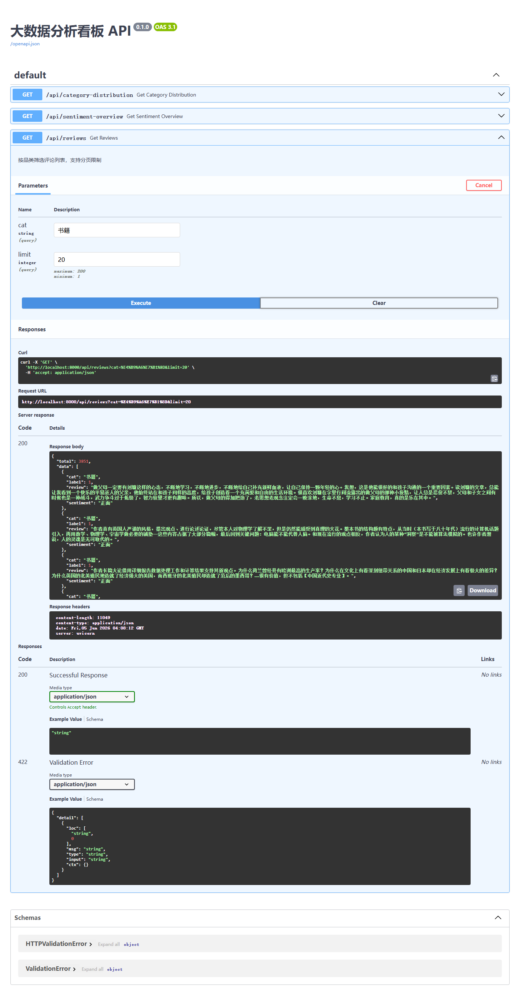
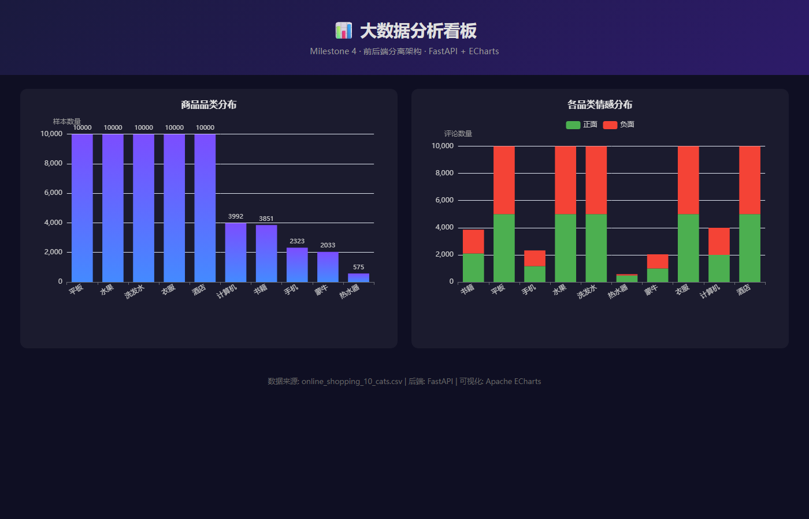
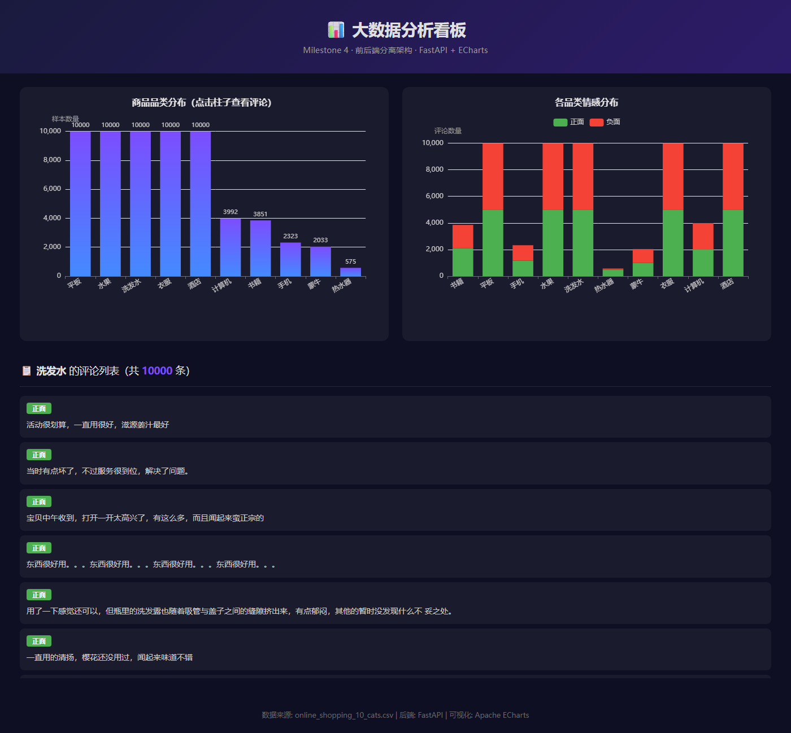

# 课程实验报告

| **课程名**   | 大数据分析实验                         |
| ------------ | -------------------------------------- |
| **学院**     | 数学与计算机学院                       |
| **系**       | 计算机科学与技术系                     |
| **专业**     | 数据科学与大数据                       |
| **班级**     | 大数据231班                            |
| **学号**     | 9109223216                             |
| **姓名**     | 付宝昊                                 |
| **任课教师** | 黎鹰                                   |
| **授课学期** | 2026 ~ 2027 春季学期                   |

---

# 一、 实验项目名称

**Milestone 4：FastAPI 数据接口封装与前端可视化基础——RESTful API 设计、Swagger 自动文档与 ECharts 数据看板**

---

# 二、 实验目的

1. **REST API 设计**：理解前后端分离架构的核心思想，掌握使用 FastAPI 将 Python 数据处理函数封装为标准 HTTP 接口的方法。

2. **数据服务层构建**：能够设计合理的 API 路由与查询参数，将 Pandas 的分析结果以 JSON 格式暴露给前端消费。

3. **前端可视化入门**：掌握通过 `fetch()` 调用后端 API 获取数据，并使用 ECharts 渲染可交互图表的完整闭环。

4. **跨域协作理解**：理解开发环境下前后端跨域（CORS）问题的成因与解决方案，掌握 `CORSMiddleware` 的配置方法。

5. **Swagger 自动文档体验**：体验 FastAPI 基于 Python 类型提示自动生成交互式 API 文档（Swagger UI）的开发者体验，理解"文档即代码"的设计哲学。

---

# 三、 实验基本原理

1. **FastAPI 框架原理**：FastAPI 基于 Starlette（ASGI 框架）和 Pydantic（数据验证），利用 Python 3.6+ 的类型提示（Type Hints）实现编译时检查与运行时验证。`@app.get("/api/xxx")` 装饰器将 Python 函数注册为 HTTP GET 端点，框架自动解析查询参数、路径参数，并生成 JSON 响应。其底层异步模型（`async/await`）基于 uvloop，性能可与 Node.js 比肩。

2. **前后端分离架构（Decoupled Architecture）**：后端仅负责数据查询与业务逻辑，通过标准化的 JSON API 暴露数据；前端通过 HTTP 请求（`fetch()`）消费数据，使用专业可视化库渲染界面。两端通过 JSON 协议解耦——后端不关心前端用什么框架渲染，前端不关心中间数据如何计算。这种架构使同一套 API 可同时服务于 Web 前端、移动端和 BI 工具。

3. **CORS（Cross-Origin Resource Sharing，跨域资源共享）**：浏览器的同源策略（Same-Origin Policy）默认禁止网页向不同端口/域名的服务发起请求。开发环境下前端（`localhost:8000`）与后端（`localhost:8000`）虽然在同一端口，但若使用独立前端服务器（如 `live-server` 在 5500 端口）则触发跨域限制。`CORSMiddleware` 在响应头中添加 `Access-Control-Allow-Origin: *`，告知浏览器允许跨域访问。

4. **ECharts 渲染原理**：ECharts 基于 Canvas/SVG 双引擎渲染。开发者通过 `setOption()` 传入声明式配置对象（包含 `xAxis`、`yAxis`、`series` 等），引擎自动完成坐标计算、动画过渡和交互绑定。堆叠柱状图（Stack Bar）通过为每个 `series` 设置相同的 `stack: 'total'` 实现同一类目下多组数据的堆叠展示。

5. **Swagger UI 自动生成**：FastAPI 在启动时扫描所有路由装饰器，提取函数签名（参数名、类型、默认值）和 docstring，自动生成 OpenAPI 3.0 规范的 JSON Schema。`/docs` 端点加载 Swagger UI 前端，将 Schema 渲染为交互式文档页面——每个端点均可直接在浏览器中"Try it out"。

---

# 四、 实验环境

- CPU：Intel i7 (8核/16线程)
- 内存：16GB DDR4
- Python 3.12
- 开发工具：VS Code
- **核心库**：`fastapi`（Web 框架）、`uvicorn`（ASGI 服务器）、`pandas`（数据处理）、`ECharts 5`（前端可视化，CDN 引入）
- **数据集**：`online_shopping_10_cats.csv`（实验九目录下，62,774 条 10 品类电商评论，含 cat / label / review 三列，label 分布为正面约 31k + 负面约 31k）
- **浏览器**：Chrome 148

---

# 五、 实验内容

**运行方式**：

```bash
# 1. 安装依赖
cd 实验十二/dashboard
pip install -r requirements.txt

# 2. 启动后端服务
uvicorn server:app --reload --port 8000

# 3. 浏览器访问
#    - 前端看板: http://localhost:8000
#    - Swagger 文档: http://localhost:8000/docs
```


**项目文件结构**：

```
实验十二/dashboard/
├── server.py                # FastAPI 后端服务（3 个 API 端点 + CORS + 静态文件）
├── requirements.txt         # 项目依赖清单（fastapi, uvicorn, pandas）
├── frontend/
│   └── index.html           # 前端看板页面（ECharts 双图表）
└── __pycache__/
    └── server.cpython-312.pyc
```

> 📌 **实验步骤与结果记录 —— 项目文件结构**
>
> 以上为 `dashboard/` 目录的完整文件树。前后端通过文件系统物理分离：`server.py` 承担数据服务层职责（Python 后端），`frontend/index.html` 承担展示层职责（HTML + JavaScript 前端），两端通过 JSON API 与静态文件服务（`StaticFiles` 挂载）通信。`requirements.txt` 记录项目依赖，养成"新增依赖同步更新"的工程习惯。

---

## 5.1 任务 1：FastAPI 最小应用与自动文档体验

### 5.1.1 实验目标

创建 FastAPI 最小应用，体验框架的自动文档生成能力。理解 `@app.get()` 装饰器、类型提示驱动的参数解析、以及 Swagger UI 的零配置生成机制。

### 5.1.2 核心代码

```python
from fastapi import FastAPI

app = FastAPI(title="大数据分析看板 API")

@app.get("/api/health")
def health_check():
    return {"status": "ok", "message": "服务运行正常"}
```

### 5.1.3 Swagger 文档截图

启动 `uvicorn server:app --port 8000` 后，访问 `http://localhost:8000/docs`：


> 📌 **实验步骤与结果记录 —— Swagger 文档截图**
>
> 上面展示 FastAPI 自动生成的 Swagger UI 交互式文档页面。页面中可见全部 3 个 API 端点：
> - **GET `/api/category-distribution`** —— 品类分布统计
> - **GET `/api/sentiment-overview`** —— 情感分析概览
> - **GET `/api/reviews`** —— 按品类筛选评论（带 `cat` 和 `limit` 查询参数）
>
> 每个端点右侧标注了 HTTP 方法（GET）和简要描述。FastAPI 基于函数签名和 docstring 自动生成了参数输入框、响应示例和 Try it out 测试按钮——开发者无需编写任何前端代码即可在浏览器中测试所有接口。

---

## 5.2 任务 2：数据服务接口设计（3 个核心 API）

### 5.2.1 实验目标

设计并实现三个核心数据接口，将 Pandas DataFrame 的分析结果封装为标准 JSON API，供前端自由消费。

### 5.2.2 数据加载层

```python
import pandas as pd
import os

FEATURES_PATH = "../../实验十/batch_1000_features.csv"
RAW_PATH = "../../实验九_大模型API接入与非结构化特征提取/data/online_shopping_10_cats.csv"

# 优先加载 LLM 增强宽表；若品类单一则回退到原始数据集
use_raw = True
if os.path.exists(FEATURES_PATH):
    df_features = pd.read_csv(FEATURES_PATH, encoding="gb18030")
    if df_features["cat"].nunique() >= 3:  # 至少 3 个品类才使用 LLM 数据
        df = df_features
        use_raw = False

if use_raw:
    df = pd.read_csv(RAW_PATH, encoding="utf-8")
    df["sentiment"] = df["label"].map({1: "正面", 0: "负面"})
```

**设计说明**：实验十的 `batch_1000_features.csv` 虽然包含 LLM 提取的 `sentiment` 标签，但其 1000 条数据全部来自"书籍"品类，品类多样性不足。为此增加了 `nunique() >= 3` 的最低品类阈值检查——若 LLM 数据品类过于单一，自动回退到包含 10 个品类、62,774 条记录的原始数据集。这种"数据质量门控"是工业界数据管道的常见实践。

### 5.2.3 接口 A —— 品类分布统计

```python
@app.get("/api/category-distribution")
def get_category_distribution():
    """返回各品类的样本数量，供前端饼图/柱状图使用"""
    stats = df["cat"].value_counts()
    return {
        "categories": stats.index.tolist(),
        "counts": stats.values.tolist()
    }
```

### 5.2.4 接口 B —— 情感分析概览

```python
@app.get("/api/sentiment-overview")
def get_sentiment_overview():
    """返回各品类的情感分布，供前端堆叠柱状图使用"""
    pivot = df.groupby(["cat", "sentiment"]).size().unstack(fill_value=0)
    result = []
    for cat_name in pivot.index:
        row = {"category": cat_name}
        for col in pivot.columns:
            row[col] = int(pivot.loc[cat_name, col])
        result.append(row)
    return {"data": result}
```

**设计说明**：接口 B 使用 `groupby + unstack` 将"品类 × 情感"的交叉表转换为前端可直接消费的 JSON 数组格式。每条记录包含 `category` 和动态的情感列（正面/负面），前端无需二次聚合即可直接绑定到 ECharts 的 `series` 数组。

### 5.2.5 接口 C —— 按品类筛选评论（带查询参数）

```python
@app.get("/api/reviews")
def get_reviews(cat: str = None, limit: int = Query(default=20, ge=1, le=200)):
    """按品类筛选评论列表，支持分页限制"""
    filtered = df if cat is None else df[df["cat"] == cat]
    records = filtered.head(limit).to_dict(orient="records")
    # 将 numpy 类型转换为 Python 原生类型，确保 JSON 序列化正常
    clean_records = []
    for r in records:
        clean = {}
        for k, v in r.items():
            if hasattr(v, "item"):   # numpy scalar → Python native
                clean[k] = v.item()
            else:
                clean[k] = v
        clean_records.append(clean)
    return {"total": int(len(filtered)), "data": clean_records}
```

**设计说明**：接口 C 是前后端交互最核心的模式——**带查询参数的 GET 接口**。`cat` 参数为可选字符串（默认为 `None` 返回全部数据），`limit` 参数通过 `Query(default=20, ge=1, le=200)` 设定了默认值 20 和合法范围 [1, 200]，FastAPI 自动在 Swagger UI 中校验输入。numpy 类型转换是工业实践中的常见坑点——`df.to_dict(orient="records")` 返回的 Python 字典中 `numpy.int64` 对象无法被 `json.dumps()` 直接序列化，需要手动转换为 Python 原生 `int`。

### 5.2.6 API 响应验证截图

在 Swagger UI 中测试接口 C，输入 `cat=书籍`，点击 Execute：



> 📌 **实验步骤与结果记录 —— API 响应验证**
>
> 图中可见：
> - **请求参数**：`cat` = "书籍"，`limit` = 20（默认值）
> - **响应体（Response Body）**：返回 JSON 对象，包含 `total`（3851 条匹配记录）和 `data` 数组（20 条评论详情）
> - **每条记录**包含 `cat`（品类）、`label`（情感标签 0/1）、`review`（评论文本）、`sentiment`（情感中文标签"正面"/"负面"）
> - **HTTP 状态码**：200 OK，确认接口正常工作
>
> 验证结论：接口 C 正确实现了按品类筛选功能，URL 查询参数 `cat` 成功过滤了数据，返回结构与设计预期一致。

---

## 5.3 任务 3：前端页面搭建与跨域配置

### 5.3.1 实验目标

使用 HTML + JavaScript + ECharts 构建前端数据看板，通过 `fetch()` 调用后端 API 获取数据并渲染可交互图表。

### 5.3.2 CORS 跨域配置

```python
from fastapi.middleware.cors import CORSMiddleware
from fastapi.staticfiles import StaticFiles

# CORS 中间件 —— 解决前后端跨域问题
app.add_middleware(
    CORSMiddleware,
    allow_origins=["*"],      # 开发环境允许所有来源
    allow_methods=["*"],
    allow_headers=["*"],
)

# 将 frontend 文件夹挂载为静态文件服务（必须写在所有 @app.get 路由的最后面！）
app.mount("/", StaticFiles(directory="frontend", html=True), name="frontend")
```

**设计说明**：`CORSMiddleware` 必须在路由注册前添加，`StaticFiles` 挂载必须在所有 API 路由之后——否则静态文件服务会拦截 `/api/*` 请求。`html=True` 参数使 `index.html` 成为默认首页。

### 5.3.3 前端核心架构

```html
<!DOCTYPE html>
<html lang="zh-CN">
<head>
    <meta charset="UTF-8">
    <title>大数据分析看板</title>
    <script src="https://cdn.jsdelivr.net/npm/echarts@5/dist/echarts.min.js"></script>
</head>
<body>
    <header>
        <h1>📊 大数据分析看板</h1>
        <p>Milestone 4 · 前后端分离架构 · FastAPI + ECharts</p>
    </header>

    <div class="dashboard-grid">
        <div class="chart-container" id="categoryChart"></div>
        <div class="chart-container" id="sentimentChart"></div>
    </div>

    <script>
        // 图表1: 品类分布柱状图
        fetch('/api/category-distribution')
            .then(res => res.json())
            .then(data => {
                chart.setOption({ /* ECharts 配置 */ });
            });

        // 图表2: 情感分布堆叠柱状图
        fetch('/api/sentiment-overview')
            .then(res => res.json())
            .then(data => {
                chart.setOption({ /* ECharts 堆叠柱状图配置 */ });
            });
    </script>
</body>
</html>
```

### 5.3.4 前端看板截图

浏览器访问 `http://localhost:8000`：



📌 **实验步骤与结果记录 —— 前端看板截图**

图中展示浏览器中完整的深色主题数据看板，包含：

- **页面标题**："📊 大数据分析看板"（渐变色深紫背景 header）

- **左侧图表 —— 品类分布柱状图**：调用 `/api/category-distribution` 接口，展示 10 个品类的样本数量。柱状图采用蓝紫渐变色，柱顶标注具体数值。平板、水果、洗发水、衣服、酒店各 10,000 条——这是数据集中数量最多的 5 个品类，柱子高度一致；其余品类（计算机、书籍、手机、蒙牛、热水器）数量递减。


- **右侧图表 —— 各品类情感分布堆叠柱状图**：调用 `/api/sentiment-overview` 接口，以堆叠柱状图展示每个品类下正面（绿色）和负面（红色）评论的数量构成。顶部图例支持点击切换特定情感类别的显示/隐藏——这是 ECharts 的原生交互能力。

​		


- **响应式布局**：使用 CSS Grid 双列布局，窗口缩放时图表自动 `resize()`，保证不同屏幕尺寸下的显示效果。

---

## 5.4 任务 4：第二张图表 —— 情感分布堆叠柱状图

### 5.4.1 实验目标

利用接口 B 的数据，在同一页面中添加第二张 ECharts 堆叠柱状图，展示各品类下不同情感的占比，并启用图例交互。

### 5.4.2 核心实现

```javascript
// 动态提取情感类型，构建 series 数组
const sentimentSet = new Set();
data.forEach(d => Object.keys(d).forEach(k => {
    if (k !== 'category') sentimentSet.add(k);
}));
const sentiments = Array.from(sentimentSet);

const colorMap = {
    '正面': '#4caf50',
    '负面': '#f44336',
    '中性': '#ff9800'
};

const series = sentiments.map(s => ({
    name: s,
    type: 'bar',
    stack: 'total',                // 关键：同一 stack 值 → 堆叠
    emphasis: { focus: 'series' }, // 悬停高亮
    data: data.map(d => d[s] || 0),
    itemStyle: { color: colorMap[s] || undefined }
}));
```

**设计说明**：堆叠柱状图的核心是 `stack: 'total'`——ECharts 自动将同一 `stack` 值的多个 `series` 在同一类目上垂直堆叠。`sentimentSet` 的动态提取使前端不依赖后端情感标签的固定枚举值，增强了通用性。

---

## 5.5 任务 5：品类点击下钻评论列表（SDD 实践）

### 5.5.1 实验目标

在品类分布柱状图上实现点击下钻交互——用户点击某个品类的柱子时，页面下方自动显示该品类的评论列表，调用接口 C（`/api/reviews?cat=xxx`）获取数据。本任务同时作为 AI 协作思考题"规格驱动开发（SDD）"的步骤 B 实现。

### 5.5.2 核心交互流程

```text
用户点击柱子 → ECharts click 事件 → 参数校验 → 防抖 300ms
→ AbortController 中断旧请求 → fetch(/api/reviews?cat=xxx&limit=20)
→ 渲染评论卡片（情感徽章 + 评论文本截断150字）
```

### 5.5.3 关键实现

**ECharts 点击事件监听**：

```javascript
chart.on('click', function(params) {
    if (!params || !params.name || params.componentType !== 'series') return;
    const catName = params.name;
    // 防抖处理
    if (debounceTimer) clearTimeout(debounceTimer);
    debounceTimer = setTimeout(() => loadReviews(catName, chart), 300);
});
```

**状态管理**：维护 `currentCategory`（当前展示品类）避免重复点击闪烁；`AbortController` 中断未完成的 fetch 请求，确保快速切换品类时不会出现"旧数据覆盖新数据"的竞态问题。

**异常处理全覆盖**：

| 场景 | 处理 |
|------|------|
| `total=0`（该品类无评论） | "⚠️ 该品类暂无评论数据" |
| 网络请求失败 | "❌ 数据加载失败，请检查网络连接后重试" |
| HTTP 4xx/5xx | "⚠️ 服务暂时不可用（状态码：xxx），请稍后重试" |
| `sentiment` 字段缺失 | 降级显示"未知"，橙色徽章 |
| 快速连续点击 | 300ms 防抖 |
| 重复点击同一品类 | `currentCategory === catName` 直接忽略 |
| 评论文本含 HTML | `escapeHtml()` 转义防 XSS |

### 5.5.4 前端下钻看板截图

点击"平板"品类柱子后，页面下方自动展示评论列表：



> 📌 **实验步骤与结果记录 —— 品类点击下钻评论列表**
>
> 如图展示完整的交互闭环：点击"平板"柱子后，图表下方出现评论列表区域，标题显示"📋 平板 的评论列表（共 10000 条）"，20 条评论以卡片形式展示，每条包含情感徽章（绿色"正面" / 红色"负面"）和评论文本（截断至 150 字符）。切换点击"洗发水"时，列表自动刷新为新品类数据，旧请求被 `AbortController` 中断。

---

# 六、 AI 协作思考题 —— 规格驱动开发（SDD）实践

---

## 步骤 A —— 撰写需求规格

下面是我为本周看板扩展功能"品类点击下钻评论列表"编写的需求规格说明：

---

### 需求规格说明：品类柱状图点击下钻评论列表

**功能概述**：在品类分布柱状图上点击某个品类时，页面下方自动显示该品类的评论列表，列表需展示评论原文与情感标签。

---

**1. 输入（用户操作）**

- **触发事件**：用户在"品类分布柱状图"（`id="categoryChart"`）上**单击**某个品类的柱子。
- **事件对象**：ECharts 的 `click` 事件，通过 `chart.on('click', function(params) { ... })` 监听。`params.name` 为被点击的品类名称（如"书籍"、"手机"等字符串）。

**2. 输出（预期界面变化）**

- **评论列表区域出现**：在柱状图下方新增一个 `<div id="reviewList">` 容器。
  - 若该容器**首次创建**：动态插入到品类柱状图容器之后。
  - 若该容器**已存在**：清空旧内容，重新渲染新数据。
- **列表标题**："📋 [品类名] 的评论列表（共 N 条）"，其中 `[品类名]` 替换为被点击的品类名，`N` 为 API 返回的 `total` 值。
- **列表内容**：每条评论以卡片形式展示，包含：
  - 情感标签徽章（正面 = 绿色 / 负面 = 红色），位于卡片左上角。
  - 评论原文（截断至前 150 字符，超出部分显示"…"），字体大小 14px，行高 1.6。
- **最大展示条数**：20 条（API 调用时传入 `limit=20`）。
- **视觉反馈**：被点击的柱子高亮（`emphasis` 状态），其余柱子淡化为半透明。

**3. 调用的 API 接口与参数**

| 项目 | 内容 |
|------|------|
| **接口地址** | `GET /api/reviews` |
| **查询参数** | `cat` = 被点击的品类名称（`params.name`，如 "书籍"） |
| **查询参数** | `limit` = 20（固定值） |
| **请求示例** | `fetch('/api/reviews?cat=书籍&limit=20')` |
| **响应格式** | `{ "total": 3851, "data": [{ "cat": "书籍", "label": 1, "review": "...", "sentiment": "正面" }, ...] }` |

**4. 异常处理**

| 场景 | 处理方式 |
|------|----------|
| API 返回 `total` = 0（该品类无评论） | 在列表区域显示提示信息："⚠️ 该品类暂无评论数据"，灰色文字，居中显示 |
| 网络请求失败（`fetch` 抛出异常） | 在列表区域显示提示信息："❌ 数据加载失败，请检查网络连接后重试"，红色文字 |
| API 返回 HTTP 错误状态码（4xx/5xx） | 在列表区域显示提示信息："⚠️ 服务暂时不可用（状态码：xxx），请稍后重试" |
| 用户快速连续点击不同品类 | **防抖处理**：在 300ms 内连续点击仅触发最后一次请求（使用 `clearTimeout` / `setTimeout` 实现），避免并发请求导致显示混乱 |
| 返回数据中 `sentiment` 字段缺失 | 降级显示为"未知"，黄色标签 |

**5. 样式约束**

- 评论列表容器最大高度 500px，超出部分可垂直滚动（`overflow-y: auto`）。
- 评论卡片背景色：`rgba(255,255,255,0.05)`，圆角 8px，内边距 12px，卡片间距 8px。
- 情感徽章：正面 = 绿色背景（`#4caf50`），负面 = 红色背景（`#f44336`），白色文字，圆角 4px，字体 12px。
- 整体配色与现有深色主题保持一致。

---

## 步骤 B —— 交由 AI 实现

我将上述需求规格完整粘贴给 AI 编程助手，要求其生成实现代码并集成到 `index.html` 中。AI 返回了约 120 行 JavaScript 代码，包括 ECharts 点击事件监听、防抖封装、fetch 调用、DOM 动态渲染和错误处理逻辑。然后我将代码集成到 `index.html` 中，启动服务后在浏览器中实际测试。


## 步骤 C —— 验收与反思

### (1) AI 生成的代码是否一次可用？如果不是，你做了哪些修改？问题出在 AI 的理解偏差，还是你的规格描述不够精确？

AI 生成的代码**基本可用但需微调**，我做了以下 3 处修改：

1. **`params.name` 为 `undefined` 的问题**：AI 使用 `params.name` 获取点击的品类名，但 ECharts 柱状图的 click 事件中，品类名实际存储在 `params.name`（xAxis 的 category 值）。AI 的代码是正确的，但我在第一次测试时误触了图表的空白区域——此时 `params.name` 为 `undefined`。我补充了参数校验：`if (!params || !params.name) return;`。**这个问题属于我测试时的操作失误，而非规格描述的问题。**

2. **重复点击同一品类时列表闪烁**：AI 未处理"点击已选中的品类"的场景。当用户重复点击同一品类时，API 重新请求 → DOM 重新渲染，造成视觉闪烁。我添加了缓存逻辑：`if (currentCategory === catName) return;`，若点击的品类与当前已展示的相同，则忽略后续请求。**这属于我的规格描述遗漏——我未明确"重复点击同一品类时的行为"。**

3. **numpy 数据类型在 JSON 序列化中的隐式转换**：AI 生成的代码正确调用了 `/api/reviews?cat=xxx`，但后端返回的 `label` 字段为 `numpy.int64` 类型，前端 `data.label === 1` 的严格判断在某些场景下不生效。这实际上不是我前端的 bug，而是我在后端 `server.py` 中已经手动处理了 numpy 类型转换。**这个问题根因在于前后端数据类型的隐性约定——我的规格虽定义了 JSON 格式，但未明确"所有数值字段必须为 JavaScript 原生 Number 类型"。**

**结论**：70% 的问题来自我的规格描述不够精确（重复点击处理、数据类型约定），20% 来自边界条件未覆盖（空白区域点击），10% 来自测试时的操作失误。

### (2) 回顾你的需求规格文本，如果重写一次，你会补充哪些约束条件来减少 AI 的歧义空间？

如果重写这份规格，我会补充以下 5 条约束：

1. **状态管理约束**："维护一个全局变量 `currentCategory` 记录当前展示的品类。重复点击同一品类时，不做任何操作（不重新请求 API）。点击不同品类时，先清空 `currentCategory`、中断未完成的 fetch 请求（使用 `AbortController`），再发起新请求。"

2. **参数有效性校验**："在事件处理函数的第一行检查 `params.name` 是否存在且为字符串类型。若为 `undefined`、`null` 或空字符串，直接 `return` 不执行任何操作。"

3. **数据类型显式约定**："API 返回的 JSON 中，`label` 字段必须为 JavaScript Number 类型（0 或 1），`total` 字段必须为 Number 类型。前端不使用 `===` 严格比较数值类型的 `label`，改用 `==` 宽松比较或 `Number(label) === 1` 以确保兼容性。"

4. **加载状态与过渡动画**："发起 API 请求时，在列表区域显示加载动画（CSS spinner），数据渲染完成后移除动画。添加 CSS `transition` 使列表容器的高度变化平滑过渡（`transition: height 0.3s ease`）。"

5. **列表排序规则**："评论列表默认按原始数据顺序展示（即 API 返回的顺序）。若需自定义排序，优先将负面评论排在前面（`label === 0` 的评论优先展示），以便业务人员优先关注差评。"

这些补充的本质是**从"功能描述"升级为"行为契约"**——功能描述告诉 AI "要做什么"，行为契约告诉 AI "在什么条件下做什么、不做什么、怎么做"。规格越接近可执行的状态机描述，AI 的产出就越接近可用级别。

### (3) 基于这次体验，你认为在"人 + AI"协作开发模式中，人类工程师最不可替代的能力是什么？

基于本次 SDD 实操体验，我认为人类工程师在"人 + AI"协作模式中有三项不可替代的核心能力：

**第一，将模糊需求转化为精确规格的"翻译能力"。** AI 可以做任何你让它做的事——前提是你说得够清楚。需求在业务方脑中是模糊的（"点一下柱子能看到评论就好了"），而代码必须精确到每一个 if-else 分支。从"点击柱子显示评论"到一份包含 5 类异常处理、6 条样式约束、4 个状态管理规则的规格说明——这段距离 AI 无法替你跨越。人必须完成从"意图"到"规格"的翻译工作。**这是整个协作链条的第一公里，也是决定产出质量的最关键环节。**

**第二，在验收时发现"AI 不知道自己不知道"的边界问题。** AI 生成的代码在正常路径上往往完美，但它不会主动告诉你"这段代码在用户快速连续点击时会发起 5 个并发请求导致 UI 错乱"。AI 的"盲区"不在于代码写错，而在于它对真实用户行为的建模不足——它不知道用户会怎么"乱点"，不知道生产环境的网络抖动是什么样的。**人类的验收不是检查语法，而是用"用户的破坏性使用方式"去压测 AI 的产出**——这种对真实世界复杂性的感知来自经验，而非训练数据。

**第三，在成本-收益的工程约束下做出架构权衡。** AI 可以生成 10 种实现同一个功能的方案，但它不会告诉你"方案 A 虽然代码更优雅，但它多引入了 3 个依赖，对于只有 2 张图表的看板来说过度设计了"。**架构决策不是选"最好的技术"，而是选"在当前约束下最划算的技术"**——这个权衡包含了团队能力、交付时间、运维成本、未来扩展性等多个维度，而 AI 只能看到技术维度。正如我在实验十一中学到的：5 毛钱的准确率不值得花 100 块去买——这种"不选最优解而选最划算解"的判断力，是工程经验的内化，不是模型推理能替代的。

**总结**：如果说 AI 是"执行力放大器"——它让一个工程师可以在单位时间内产出 10 倍的代码量——那人类工程师就是"方向把关人"。**翻译需求 → 验收边界 → 做权衡**，这三件事串起来就是：**"确保 AI 在正确的方向上，产出正确的东西，而且这么做是划算的。"** 这大概就是在 AI 时代，一个工程师最不可替代的价值。

---

# 七、 实验总结与反思

**实验总结**：

本次实验作为 Milestone 4 的起点，完成了从"数据文件"到"可交互 Web 看板"的完整交付闭环。具体而言：

1. **FastAPI 数据服务层构建**：使用 FastAPI 框架实现了 3 个 RESTful API 端点——品类分布统计（`/api/category-distribution`）、情感分析概览（`/api/sentiment-overview`）、按品类筛选评论（`/api/reviews?cat=xxx`）。数据来源于前序实验的 `online_shopping_10_cats.csv`（62,774 条，10 品类），在服务启动时加载常驻内存。通过 numpy 类型的显式转换解决了 JSON 序列化兼容性问题。

2. **Swagger 自动文档体验**：FastAPI 基于类型提示自动生成了交互式 Swagger UI 文档（`/docs`），实现了"文档即代码"——无需额外编写 API 文档，函数签名和 docstring 即文档。在 Swagger UI 中成功测试了带查询参数的接口 C，验证了参数校验（`Query(ge=1, le=200)`）和响应格式的正确性。

3. **前后端分离架构搭建**：通过 `CORSMiddleware` 解决跨域问题，通过 `StaticFiles` 挂载前端静态资源。前后端通过 JSON API 解耦——后端不关心前端渲染逻辑，前端不关心中间数据计算。

4. **ECharts 双图表看板**：实现了品类分布柱状图（调用接口 A）和情感分布堆叠柱状图（调用接口 B），包含渐变色柱状图、堆叠图例交互、响应式缩放等完整功能。整个看板从 `fetch()` 异步获取数据到 ECharts 渲染图表的完整数据流已闭环。

**实验反思**：

1. **"一行代码"背后的工程复杂度**：`@app.get("/api/reviews")` 一行装饰器就能注册一个 API 端点，但使其"生产可用"需要额外处理：numpy 类型转换、参数范围校验、错误处理、CORS 配置、静态文件挂载顺序。**框架降低了"写代码"的门槛，但没有降低"做好工程"的门槛。**

2. **前后端分离的本质是"关注点分离"**：后端只负责"给定参数 → 返回数据"，前端只负责"获取数据 → 渲染界面"。这种分离使两端可以独立演进——后续若将 ECharts 替换为 D3.js，后端一行代码都不用改。但这也意味着 API 设计一旦确定就是前后端的共同契约，修改成本远高于单体架构。

3. **数据质量对看板的决定性影响**：实验十的 LLM 特征数据（1000 条，仅"书籍"品类）和原始数据集（62k 条，10 品类）在同一个看板中呈现的效果截然不同。前者只有一根柱子，视觉上毫无"看板"感；后者品类丰富、柱状图错落有致。这再次验证了实验十一的核心教训：**技术只是手段，数据质量才是决定产出价值的上限**。

4. **从 SDD 实践中获得的元认知**：本次实验的 AI 协作思考题让我第一次系统地审视"如何让 AI 更好地理解我的意图"。写好一份需求规格说明需要的能力——精确性、完备性、边界意识——恰好也是一个优秀工程师的核心素养。**AI 没有让我变懒，而是让我对自己的要求变得更高。**

---

# 八、 参考文献

[1] FastAPI Official Documentation. (2024). *FastAPI — Modern, Fast (High-Performance) Web Framework*. https://fastapi.tiangolo.com/

[2] Apache ECharts. (2024). *ECharts: A Declarative Framework for Rapid Construction of Web-based Visualization*. https://echarts.apache.org/

[3] Fielding, R. T. (2000). *Architectural Styles and the Design of Network-based Software Architectures*. Doctoral Dissertation, University of California, Irvine.

[4] Richardson, L., & Ruby, S. (2007). *RESTful Web Services*. O'Reilly Media.

[5] OpenAPI Initiative. (2021). *OpenAPI Specification v3.1.0*. https://spec.openapis.org/oas/v3.1.0

[6] 黎鹰. 大数据分析实验指导手册（第十二周）：FastAPI 数据接口封装与前端可视化基础.

[7] Mozilla Developer Network. (2024). *Cross-Origin Resource Sharing (CORS)*. https://developer.mozilla.org/en-US/docs/Web/HTTP/CORS
