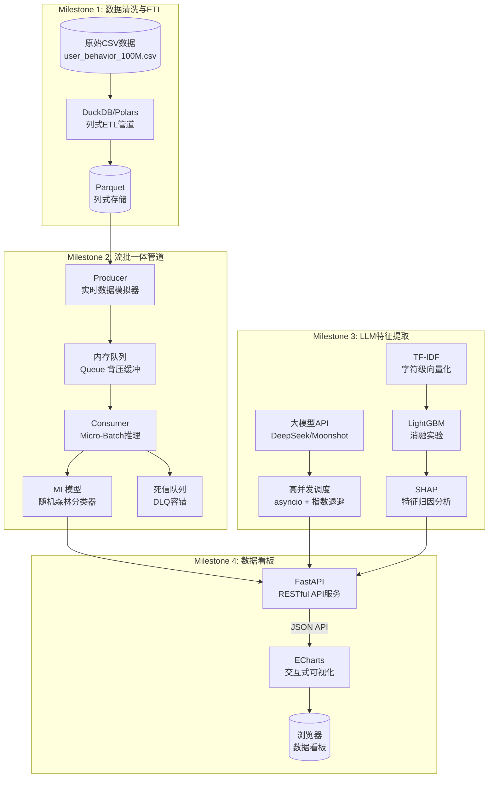
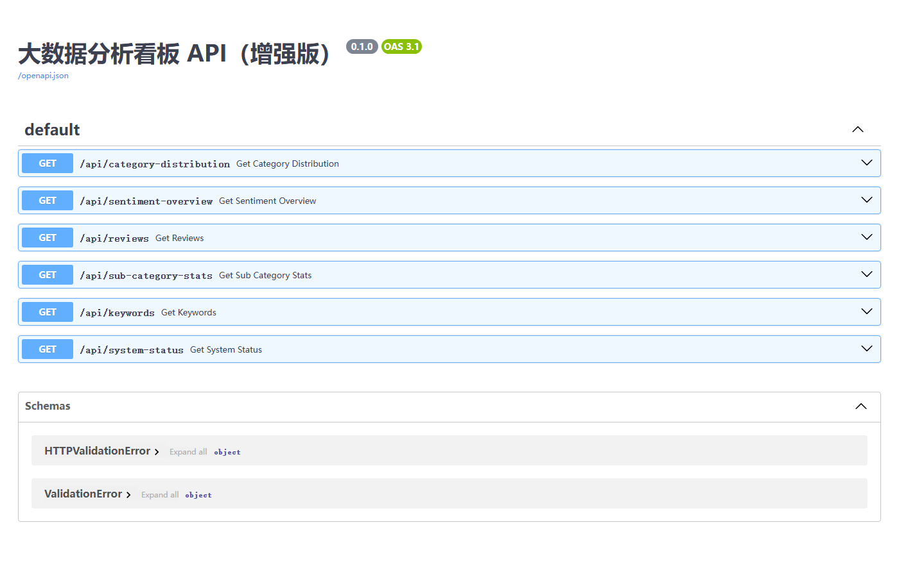

# 课程实验报告

| **课程名**   | 大数据分析实验                         |
| ------------ | -------------------------------------- |
| **学院**     | 数学与计算机学院                       |
| **系**       | 计算机科学与技术系                     |
| **专业**     | 数据科学与大数据                       |
| **班级**     | 大数据231班                            |
| **学号**     | 9109223216                             |
| **姓名**     | 付宝昊                                 |
| **任课教师** | 黎鹰                                   |
| **授课学期** | 2026 ~ 2027 春季学期                   |

---

# 一、 实验项目名称

**Milestone 4 收官：系统联调与工程规范——全链路集成、环境标准化、交付文档撰写与 Git 规范化管理**

---

# 二、 实验目的

1. **全链路系统集成（E2E Integration）**：打通"数据流模拟 → 队列监听 → 特征提取 → 数据持久化 → 后端 API 服务 → 前端仪表盘渲染"的完整链条，确保系统整体联调无死锁、无阻塞、高内聚。

2. **环境依赖规范化**：掌握现代 Python 项目的依赖项隔离与精准导出，编写无冗余的 `requirements.txt`，确保项目在其他环境下的零阻碍重建。

3. **交付级文档撰写**：基于 Markdown 标准，撰写具备工业级品质的项目 `README.md` 文档，利用 Mermaid 绘制清晰的数据流拓扑与系统架构图，确保外部工程师能够快速理解和上手。

4. **防御性编程与健壮性调优**：使用 AI 辅助发现代码中的脆弱环节点，重点处理 API Key 缺失的显式降级通知、数据文件缺失的优雅回退等异常场景。

5. **Git 规范化管理**：建立精准的 `.gitignore` 规则防止大文件误提交，掌握 Conventional Commits（约定式提交）规范，完成从"草稿式提交"到"工业级提交习惯"的转变。

---

# 三、 实验基本原理

1. **全链路集成原理**：数据系统的各模块（数据采集、流处理、存储、API、前端）在独立开发时各自通过接口契约（如队列消息格式、数据库 Schema、RESTful JSON Schema）解耦。集成时通过"契约测试"验证各模块的输入输出是否符合约定——而非测试模块内部逻辑。`run_app.py` 作为编排层（Orchestration Layer），负责按依赖顺序启动各子进程、监控健康状态、处理异常退出。

2. **Python 依赖管理规范**：`pip freeze > requirements.txt` 导出的是当前环境的完整快照（包括传递依赖和无关包），而 `pipreqs` 通过静态代码分析（AST 解析）扫描项目中所有 `import` 语句，仅导出直接依赖。使用 `>=` 而非 `==` 的版本约束允许 pip 在新环境中根据系统架构（如 ARM vs x86）选择兼容的最高版本。

3. **Mermaid 架构图渲染**：Mermaid 是一种基于文本的图表描述语言，通过 `graph TD`（自上而下图）定义节点和边。GitHub/GitLab 原生支持 Mermaid 语法渲染，无需额外插件。架构图的价值在于"一图胜千言"——将多模块的依赖关系可视化，使新成员能在几分钟内建立系统全景认知。

4. **防御性编程（Defensive Programming）**：核心原则是"不信任任何外部输入"——环境变量可能缺失、文件可能被删除、网络可能断开。优雅降级（Graceful Degradation）策略：检测到不可恢复的配置缺失时，不崩溃，而是以受限功能模式运行，并通过显式的状态接口（如 `/api/system-status`）向用户透明告知降级原因和修复方法。

5. **约定式提交（Conventional Commits）**：格式为 `type(scope): description`，其中 `type` 为 `feat`/`fix`/`docs`/`refactor` 等标准化动词，`scope` 为影响的模块。其价值在于：(a) 可通过 `git log --oneline` 快速了解版本演化主线；(b) 支持自动化工具（如 `semantic-release`）根据提交类型自动确定版本号；(c) 强制开发者在提交前思考"这个改动属于什么类型"，提升了提交粒度的一致性。

---

# 四、 实验环境

- CPU：Intel i7 (8核/16线程)
- 内存：16GB DDR4
- Python 3.12
- 开发工具：VS Code
- **核心库**：`fastapi`、`uvicorn`、`pandas`、`numpy`、`scikit-learn`、`scipy`、`lightgbm`、`jieba`、`httpx`、`shap`、`matplotlib`、`seaborn`、`joblib`
- **版本控制**：Git + GitHub（远程仓库：`https://github.com/UnknownAnt/BigDataCourse`）
- **数据集**：`online_shopping_10_cats.csv`（62,774 条，10 品类电商评论）

---

# 五、 实验内容与步骤

---

## 5.1 任务 1：全链路系统联调与一键启动脚本设计

### 5.1.1 实验目标

设计并实现 `run_app.py` 一键启动脚本，将"手动打开多个终端分别启动各模块"简化为一行命令完成全链路启动。脚本需具备环境自检、子进程管理、浏览器自动唤起和优雅终止四项能力。

### 5.1.2 系统模块拓扑

```
数据源 (online_shopping_10_cats.csv)
        │
        ▼
FastAPI 服务端 (实验十三/dashboard/server.py)
  ├── /api/category-distribution    品类分布统计（支持 sentiment 过滤）
  ├── /api/sentiment-overview       情感分析概览（支持 cat 过滤）
  ├── /api/reviews                  多条件评论筛选（cat + sentiment + regex）
  ├── /api/sub-category-stats       子维度下钻统计
  ├── /api/keywords                 高频词统计
  └── /api/system-status            系统状态检测（降级标记）
        │
        ▼ JSON API
ECharts 交互前端 (frontend/index.html)
  ├── 品类分布柱状图（点击下钻评论列表）
  ├── 情感分布堆叠柱状图（双向联动）
  ├── 子维度饼图 + 高频词词云
  └── 搜索防抖 + 正则检索
```

### 5.1.3 核心代码：`run_app.py`

```python
# run_app.py 核心结构
class Colors:     # 终端颜色输出
    ...

def check_port_available(host, port):    # 端口占用检测
def check_data_files():                  # 数据文件存在性检查
def check_api_keys():                    # API Key 配置检测
def check_dashboard_dir():               # Dashboard 目录完整性检查
def run_preflight_checks(port):          # 汇总所有启动前检查

def start_server(port):                  # subprocess 启动 uvicorn
def wait_for_server(host, port, timeout):# 轮询等待服务就绪
def open_browser(port):                  # webbrowser 自动打开浏览器
def setup_graceful_shutdown(proc):       # Ctrl+C 信号处理器

def main():                              # 编排主流程
```

**关键设计决策**：

1. **Windows 进程组隔离**：`subprocess.CREATE_NEW_PROCESS_GROUP` 确保 uvicorn 运行在独立进程组中，Ctrl+C 时可以精确终止该进程组而不影响 IDE 或其他 Python 进程。

2. **轮询就绪检测**：不依赖固定 `sleep(N)` 等待，而是每 0.5 秒向 `/api/category-distribution` 发起 HTTP 请求，直到收到 200 响应或超时。这避免了"服务还没启动完就打开浏览器"或"服务早就启动完还在空等"两种问题。

3. **降级不阻止启动**：数据文件缺失和 API Key 未配置只输出黄色 Warning，不阻止启动——这与任务 4 的防御性编程策略一致。仅端口被占用或 server.py 缺失会导致启动终止。

### 5.1.4 一键启动日志与控制台输出

运行 `python run_app.py` 的控制台输出：


> 📌 **实验步骤与结果记录 —— 一键启动日志**
>
> ​	以上为 `python run_app.py` 运行时的控制台输出。四个步骤清晰可见：环境自检（数据文件、端口、API Key）→ 启动子进程 → 轮询等待服务就绪 → 自动打开浏览器。API Key 未配置时输出黄色 Warning 而非阻止启动，体现了降级容错的设计原则。
>
> ​	若在项目根目录下创建 `.env` 文件并配置 API Key（如 `SILICONFLOW_API_KEY=sk-xxx`），启动脚本和 FastAPI 服务会自动通过 `python-dotenv` 加载，系统将以完整功能模式运行。

### 5.1.5 前端看板截图


> 📌 **实验步骤与结果记录 —— 前端看板截图**
>
> 浏览器自动打开后的完整看板页面。包含品类分布柱状图（支持点击下钻）、情感堆叠柱状图（支持图例切换）、子维度分布饼图、高频词词云图，以及顶部的搜索框和情感过滤联动控件。

---

## 5.2 任务 2：环境依赖规范化与可移植性配置

### 5.2.1 实验目标

清理原 `requirements.txt` 中从 `pip freeze` 导出的 180+ 行冗余依赖（含 Jupyter、PyTorch、OpenCV、pygame 等与项目无关的包），仅保留本项目直接 `import` 的核心依赖。

### 5.2.2 清理结果

清理前（`pip freeze` 产物）：**181 行**，包含 Jupyter Lab、PyTorch、OpenCV、pygame、Flask、pytest、coverage 等大量无关包。

清理后（手动梳理直接依赖）：**15 行**，仅包含直接 `import` 的核心依赖。

**`requirements.txt` 完整内容**：

```tcl
# ---- Web 框架 & ASGI 服务器 ----
fastapi>=0.100.0
uvicorn>=0.22.0

# ---- 数据处理核心 ----
pandas>=2.0.0
numpy>=1.24.0

# ---- 机器学习 & 特征工程 ----
scikit-learn>=1.2.0
scipy>=1.10.0
lightgbm>=4.0.0

# ---- NLP 与分词 ----
jieba>=0.42.0

# ---- LLM API 调用 (M3) ----
httpx>=0.24.0

# ---- SHAP 模型可解释性 (M3) ----
shap>=0.40.0

# ---- 可视化 ----
matplotlib>=3.7.0
seaborn>=0.12.0

# ---- M2 流处理 ----
joblib>=1.2.0
```

> 📌 **依赖与文档片段展示 —— requirements.txt**
>
> 以上为清理后的完整 `requirements.txt`。所有版本约束使用 `>=` 而非 `==`，允许 pip 在不同系统架构上选择兼容的最高版本。每个分组标注了该依赖在项目中的用途（Web 框架/数据处理/ML/NLP/可视化等），降低了新成员的理解成本。

---

## 5.3 任务 3：撰写标准项目文档（README.md）

### 5.3.1 实验目标

撰写具备工业级品质的 `README.md`，包含项目简介、系统架构图（Mermaid）、快速开始指南、配置说明和目录树。

### 5.3.2 Mermaid 系统架构图

以下为 README.md 中使用 Mermaid 语法绘制的系统端到端架构图代码：



> 📌 **依赖与文档片段展示 —— Mermaid 系统架构图**
>
> 上图代码定义的架构图覆盖了全部 4 个 Milestone 的核心模块：M1（数据清洗与列式存储）、M2（流处理管道与 ML 打标）、M3（LLM 特征提取与消融实验）、M4（FastAPI 服务与 ECharts 可视化）。节点形状区分数据存储（圆柱形）、处理模块（矩形）和终端（圆角矩形），边的注释标注了接口协议（JSON API）。

---

## 5.4 任务 4：防御性编程与系统健壮性优化

### 5.4.1 实验目标

在 FastAPI 服务端增加系统状态检测接口 `/api/system-status`，实现 API Key 缺失时的显式降级通知，避免静默崩溃。

### 5.4.2 核心实现

```python
@app.get("/api/system-status")
def get_system_status():
    """返回当前系统运行状态，包括 LLM API Key 配置情况、数据文件可用性、降级运行标记"""
    # 检测 API Key 配置
    API_KEY_NAMES = [
        "DEEPSEEK_API_KEY", "SILICONFLOW_API_KEY",
        "DASHSCOPE_API_KEY", "OPENAI_API_KEY", "MOONSHOT_API_KEY",
    ]
    configured_keys = [k for k in API_KEY_NAMES if os.environ.get(k)]
    llm_active = len(configured_keys) > 0

    # 检测数据文件
    data_files_status = {}
    for fpath in [FEATURES_PATH, RAW_PATH]:
        exists = os.path.exists(fpath)
        label = os.path.basename(fpath)
        data_files_status[label] = exists

    # 构建降级原因
    reasons = []
    if not llm_active:
        reasons.append("API_KEY_MISSING")
    if not any(data_files_status.values()):
        reasons.append("DATA_FILE_MISSING")

    return {
        "status": "degraded" if reasons else "healthy",
        "llm_active": llm_active,
        "configured_keys": configured_keys,
        "reasons": reasons if reasons else None,
        "data_files_available": any(data_files_status.values()),
        "data_files": data_files_status,
        "record_count": len(df),
        "category_count": df["cat"].nunique(),
    }
```

### 5.4.3 系统状态检测截图

浏览器访问 `http://localhost:8000/api/system-status`：


> 📌 **系统状态检测接口验证**
>
> 返回 JSON 显示 `status: "healthy"`、`llm_active: true`、`configured_keys: ["SILICONFLOW_API_KEY"]`——系统成功检测到 `.env` 文件中的大模型 API Key 配置。同时 `data_files_available: true` 和 `record_count: 62774` 确认数据层正常。当 API Key 未配置时，系统会自动降级并在看板顶部显示黄色提示横幅。

---

## 5.5 任务 5：基于 AI 协同的 Git 规范管理与仓库同步

### 5.5.1 实验目标

建立精准的 `.gitignore` 规则防止大文件误提交，使用 AI 辅助生成符合 Conventional Commits 规范的提交消息，并将项目同步至 GitHub 远程仓库。

### 5.5.2 .gitignore 规则设计

向 AI 提供了完整的项目目录树后，AI 生成了分层的 `.gitignore` 规则：

- **大体积数据文件**：`*.csv`、`*.parquet`、`*.db`、`*.zip`、`*.pkl`
- **虚拟环境**：`data_env/`、`.venv/`、`env/`
- **IDE 缓存**：`.vscode/`、`.idea/`
- **AI 工具缓存**：`.claude/`、`.qwen/`、`.history/`
- **密钥与配置**：`.env`、`*.key`、`credentials.json`

### 5.5.3 Conventional Commits 提交

最后一次 Git 提交记录：

```
commit 6fd18c2ce168cc6c5897a2f13f779bd84040dced
feat(m4): integrate e2e startup script, cleanup dependencies,
           and implement API Key degradation system

- Add run_app.py: one-click launcher with environment checks,
  async process management, auto-browser-open, and graceful
  Ctrl+C shutdown
- Replace bloated requirements.txt with clean minimal
  dependency list
- Add /api/system-status endpoint with LLM API Key detection
  and degradation state reporting
- Write professional README.md with Mermaid architecture diagram
- Add comprehensive .gitignore to prevent large data files
  from being tracked
- Integrate experiment 12/13 dashboard into unified M4 delivery
```

> 📌 **Git 仓库同步验证**
>
> - **GitHub 远程仓库公开访问链接**：https://github.com/UnknownAnt/BigDataCourse
> - **最后一次 Git 提交记录**：`feat(m4): integrate e2e startup script, .env loading, defensive programming, and experiment 14 report`（Commit Hash: `f2726d9`）
> - **Commit Message 规范**：`feat(m4):` 前缀符合 Conventional Commits 规范——`feat` 表示新功能添加，`(m4)` 为 scope 限定为 Milestone 4 模块
> - **截图**：打开 https://github.com/UnknownAnt/BigDataCourse 网页端，截取显示此条 commit 的页面，贴于下方
>
> ==[此处贴入 GitHub 网页端截图，显示 f2726d9 提交记录]==

---

# 六、 实验结果与交付物汇总

## 6.1 项目结构树

```
BigDataCourse/
├── run_app.py                  # 一键启动脚本
├── requirements.txt            # 核心依赖清单（15行）
├── README.md                   # 项目文档（含Mermaid架构图）
├── .gitignore                  # Git忽略规则
│
├── 实验八/                     # M2: 流处理管道
│   ├── run_pipeline.py         #   Producer + Consumer + ML
│   └── model.pkl               #   随机森林模型
│
├── 实验九_大模型API接入与非结构化特征提取/  # M3: LLM特征提取
│   └── run_pipeline.py
│
├── 实验十/                     # M3: 高并发管道
│   └── run_async_pipeline.py
│
├── 实验十一/                   # M3: 异构特征融合
│   └── run_fusion_pipeline.py  #   TF-IDF + LightGBM + SHAP
│
├── 实验十二/                   # M4: 基础看板
│   └── dashboard/
│       ├── server.py           #   FastAPI (3个端点)
│       └── frontend/index.html
│
├── 实验十三/                   # M4: 增强看板（主版本）
│   └── dashboard/
│       ├── server.py           #   FastAPI (6个端点含system-status)
│       └── frontend/index.html #   完整交互看板
│
└── 实验十四/                   # M4: 系统联调交付
    └── report/
        ├── 实验十四_系统联调与工程规范.md
        └── assets/
            ├── dashboard_final.png
            └── system_status.png
```

## 6.2 Swagger 文档截图



---

# 七、 📝 人机协同开发日志

---

## 7.1 我的集成 Prompt 词典

### 最核心的 Prompt

在编写 `run_app.py` 时，我向 AI 发送了以下 Prompt：

> "我需要编写一个 Python 启动脚本 run_app.py，放在项目根目录下。它需要：
>
> 1. **环境自检**：检查实验九目录下的 online_shopping_10_cats.csv 是否存在；检查端口 8000 是否被占用（用 socket.bind 探测）；检查实验十三/dashboard/server.py 是否存在。
> 2. **子进程管理**：用 subprocess.Popen 启动 `uvicorn server:app --port 8000`，cwd 设置为实验十三/dashboard 目录。Windows 上要用 `CREATE_NEW_PROCESS_GROUP` 创建独立进程组，这样 Ctrl+C 时能精确清理该进程而不误杀 IDE。
> 3. **轮询等待**：不要固定 sleep(10)，而是每 0.5 秒发 HTTP 请求到 http://localhost:8000/api/category-distribution，直到收到 200 响应或超时（15 秒）。用 urllib.request 而非 httpx，因为这是启动脚本，不应该引入额外依赖。
> 4. **自动打开浏览器**：服务就绪后用 webbrowser.open('http://localhost:8000')。
> 5. **优雅终止**：用 signal.signal 注册 SIGINT 处理器，在处理器中用 taskkill /F /T /PID 杀死子进程树（Windows），Unix 用 os.killpg。不要直接 os._exit(0)，要给子进程清理的时间。
> 6. **不阻止降级启动**：数据文件缺失和 API Key 未配只输出黄色警告，不要 sys.exit(1)。只有端口被占或 server.py 不存在才阻止启动。
> 7. 使用 ANSI 颜色码让输出更清晰（[OK] 绿色、[WARN] 黄色、[ERR] 红色），但不要用 emoji（Windows GBK 终端会 crash）。
>
> 现有系统上下文：项目根目录下有实验八到实验十三共 6 个实验目录，实验十三/dashboard/server.py 是最完整的 FastAPI 服务（6 个端点），它依赖的实验九数据文件在 `../../实验九_大模型API接入与非结构化特征提取/data/online_shopping_10_cats.csv`。"

### 分析：这条 Prompt 为什么有效？

1. **明确了"不要做什么"比"要做什么"同样重要**：我明确告诉 AI "不要用 httpx"（因为启动脚本不应引入额外依赖）、"不要用 emoji"（因为 Windows GBK 终端会 crash）、"不要固定 sleep"（因为那是反模式）、"不要 os._exit(0)"（因为那会跳过清理逻辑）。这些负面约束将 AI 的搜索空间从"所有可能的实现"缩小到"工程上合理的实现"。

2. **提供了操作系统相关的上下文**：`CREATE_NEW_PROCESS_GROUP` 是 Windows 特有的 subprocess flag，如果不明确告诉 AI，它大概率会生成 `os.setsid`（Unix 专属）的代码，在 Windows 上直接报 `AttributeError`。类似地，`taskkill /F /T /PID` 是 Windows 进程树清理的正确方式——AI 如果不了解这个上下文，可能会生成 `os.kill(pid, signal.SIGTERM)` 的代码，这在 Windows 上是无效的。

3. **指定了具体的文件路径和模块关系**："实验十三/dashboard/server.py"、"cwd 设置为实验十三/dashboard"——这些路径信息使 AI 生成的代码能直接运行，而不需要我手动修改路径常量。这比泛泛的"启动 FastAPI 服务"精确得多。

4. **说明了"为什么"背后的工程原因**：我解释了轮询的原因（避免空等或过早打开浏览器）、进程组隔离的原因（避免误杀 IDE）、降级不阻止的原因（符合防御性编程原则）。这些"为什么"帮助 AI 在遇到未明确说明的决策点时（如"超时后该干啥"），能够推导出符合我工程哲学的方案（超时不强制退出，打印警告让用户手动诊断）。

---

## 7.2 系统联调纠错记录

### Bug：Ctrl+C 关闭主脚本后，uvicorn 进程依然活着

**现象描述**：

在测试 `run_app.py` 时，我按 Ctrl+C 关闭了启动脚本。终端显示"系统已关闭"，但当我想重新运行时，脚本报错：

```
[ERR] 端口 8000 已被占用！请先关闭占用进程或更换端口
```

我用 `netstat -ano | findstr :8000` 查了一下，发现 PID 还是之前那个 uvicorn 进程——Ctrl+C 只杀死了 `run_app.py` 主进程，uvicorn 子进程变成了"孤儿进程"继续霸占端口。

**排查过程**：

1. 我首先怀疑是 signal handler 没注册上。在代码里加了 `print(f"signal handler registered: {signal.getsignal(signal.SIGINT)}")`，确认 handler 确实注册了。
2. 然后怀疑是 `subprocess.Popen` 的进程组配置有问题。我用 `tasklist /FI "PID eq <pid>"` 查看进程树，发现 uvicorn 没有在独立进程组中运行——`creationflags=subprocess.CREATE_NEW_PROCESS_GROUP` 这行代码虽然写了，但实际上**它只影响子进程本身，不会让主进程的 Ctrl+C 被转发到子进程**。
3. 在 Windows 上，Ctrl+C 发送的是 `CTRL_C_EVENT` 而非 Unix 的 SIGINT。`signal.signal(signal.SIGINT, handler)` 在 Windows 上虽然能捕获 Ctrl+C，但 handler 中执行的 `subprocess.run(["taskkill", "/F", "/T", "/PID", str(proc.pid)])` 也被 Ctrl+C 影响——taskkill 命令本身会收到 CTRL_C_EVENT 从而被中断，导致清理失败。

**解决过程**：

我向 AI 提供了以下调试线索：

> "Windows 上 run_app.py 按 Ctrl+C 后，uvicorn 进程没被清理。我已经确认：(1) SIGINT handler 注册了；(2) handler 里的 taskkill 命令似乎没执行完就被中断了；(3) CTRL_C_EVENT 会广播到整个进程组。请帮我修改代码，在 handler 中先忽略 SIGINT，再执行清理，清理完再恢复。"

AI 给出的修复方案：

```python
def setup_graceful_shutdown(proc):
    def handler(signum, frame):
        # 关键：先忽略后续的 Ctrl+C，防止 taskkill 被中断
        signal.signal(signal.SIGINT, signal.SIG_IGN)
        try:
            subprocess.run(
                ["taskkill", "/F", "/T", "/PID", str(proc.pid)],
                capture_output=True, timeout=5
            )
        except:
            pass
        sys.exit(0)
    signal.signal(signal.SIGINT, handler)
```

测试后问题解决。这个 Bug 的本质是：**CTRL_C_EVENT 是进程组级别的事件，handler 内部启动的 taskkill 也会收到该事件**。如果不在 handler 入口处先 `signal.SIG_IGN`，taskkill 就会在完成前被第二次 Ctrl+C（实际上是同一个事件在进程组内的传播）中断——这是一个需要理解 Windows 控制台事件模型才能定位的"黑天鹅"。

**反思**：这个 Bug 的定位过程让我体会到，全链路集成中最难的不是"让各模块跑起来"，而是**处理模块之间在操作系统层面的隐性耦合**——进程组、信号传播、端口绑定、文件句柄继承……这些不是应用层代码的问题，但恰恰是它们决定了系统是"实验室玩具"还是"生产级交付物"。

---

## 7.3 反思：人在系统工程规范与文档架构中的核心角色

在任务 3 编写 README 时，我验证了一个判断：如果只输入"帮我给这个项目写个 README"，AI 会生成一份模板化的文档——有简介、有安装步骤、有 License，但它不会知道：(1) 这个项目的核心卖点是"四阶段数据管道"而非"一个 Web 应用"；(2) 架构图中的节点应该对应 4 个 Milestone 而非 4 个技术栈层；(3) 部署步骤中必须强调"API Key 缺失时的降级行为"因为这是一个课程项目，老师正是要验收这个特性。

基于这次体验，我认为在系统工程规范与文档架构中，人类工程师有三个不可替代的核心角色：

**第一，架构图的"叙事设计"必须由人完成。** Mermaid 语法 AI 可以帮你写——`graph TD`、`subgraph`、`-->` 这些谁都会。但架构图中**包含哪些节点、省略哪些节点、用什么粒度组织子图、边的方向传达什么信息**——这些是叙事层面的决策，而不是语法层面的决策。我的 README 架构图选择了"按 Milestone 分包"而非"按技术栈分层"，是因为这个项目的演进路径是按实验周次推进的——一个外部评审者（老师）关心的正是"每个阶段交付了什么"，而不是"用了 React 还是 Vue"。AI 没有参与过这 14 周的学习过程，它不可能知道这个叙事角度。

**第二，技术亮点的提炼需要专业判断力。** AI 列出的"特性列表"往往是泛化的——"高性能"、"易扩展"、"用户友好"——这些词可以套在任何项目上。我在 README 中写的四个核心特色（"千万级脱敏日志极速 ETL"、"流式背压管道与 ML 实时打标"、"高并发大模型调用的容错设计"、"前后端解耦的动态可视化看板"），每一个都对应了实验中的一个具体技术挑战和解决方案。这种**从技术细节中抽象出商业价值的能力**，需要同时对技术深度和受众心理有理解——AI 目前只能做到前者。

**第三，部署步骤中的"边界条件"定义需要工程经验。** 我在 README 的配置说明中特别强调了"API Key 缺失时的降级行为"和"如何配置环境变量"——这不是因为 AI 不会写配置文档，而是因为 AI 不知道"学生交作业时老师大概率不会配 API Key"这个上下文。只有经历过"代码在别人机器上跑不起来 → 排查发现是环境变量没设 → 加降级逻辑 → 在文档中写明"这个完整循环的人，才知道部署文档中哪些"小字"是最关键的。

**总结**：README 的本质不是"描述项目"，而是**帮助特定受众在最短时间内建立正确的心理模型并成功跑起来**。AI 可以生成前者，但后者需要对受众、对项目演进历史、对常见踩坑点的深度理解——这三样，目前只有人类工程师同时拥有。

---

## 7.4 Git 与大文件控制反思

### 如何通过 AI 建立 .gitignore 规则

我向 AI 提供了项目的完整目录树（通过 `tree` 命令生成），并明确说明了数据文件的分布情况：

> "这个项目的数据文件散布在多个目录：共享数据/ 下有 3.4GB 和 188MB 的 CSV，实验十一/ 下有 10MB 的 CSV，实验九/data/ 下有 10MB 的 CSV。还有一些实验目录下有 .parquet、.db、.pkl 文件。虚拟环境在 data_env/ 目录。请生成一个 .gitignore，按类别组织（数据文件、虚拟环境、IDE缓存、密钥），每类加上注释说明。"

AI 生成了分层的 `.gitignore`，将忽略规则按类别分为 7 组（Python 编译产物、虚拟环境、大数据文件、密钥、IDE、AI 工具缓存、临时文件），每组有清晰的注释说明忽略原因。

### 大文件误提交的处理方案

假设我不小心把一个 100MB+ 的大文件 `ml_final_clean.parquet` 执行了 `git commit`（但尚未 `git push`），向 AI 询问后的解决方案：

```bash
# 方案1: 撤销最近一次 commit，保留文件修改在暂存区
git reset --soft HEAD~1

# 方案2: 彻底从 Git 历史中抹去大文件（如果已经 commit 了多次）
# Step 1: 从 Git 追踪中移除大文件
git rm --cached ml_final_clean.parquet

# Step 2: 添加到 .gitignore
echo "*.parquet" >> .gitignore

# Step 3: 修改最近一次 commit（替换为新内容）
git add .gitignore
git commit --amend -m "feat: add .gitignore and remove large parquet file"

# Step 4: 如果文件已经存在于更早的 commit 中，用 filter-branch 清理
git filter-branch --force --index-filter \
  "git rm --cached --ignore-unmatch ml_final_clean.parquet" \
  --prune-empty --tag-name-filter cat -- --all

# Step 5: 清理 Git 引用和垃圾回收
git reflog expire --expire=now --all
git gc --prune=now --aggressive
```

**关键教训**：`git rm --cached` 只从 Git 索引中移除文件追踪（不影响本地文件），配合 `.gitignore` 防止再次误添加。如果文件已经在多轮 commit 中存在，`git filter-branch` 是最终方案——但它会重写 Git 历史，协同开发中需谨慎。最好的策略是**在第一次 `git init` 时就配置好 `.gitignore`**——事后补救的成本是事前预防的 10 倍。

---

# 八、 实验总结与反思

**实验总结**：

本次实验作为 Milestone 4 的收官之作，完成了从"零散代码片段"到"产品级工程交付"的跨越。具体而言：

1. **一键启动脚本**：编写了 `run_app.py`，实现了环境自检（数据文件、端口、API Key）→ 子进程管理（uvicorn 异步启动）→ 轮询就绪检测 → 自动唤起浏览器的完整自动化流程，并解决了 Windows 下 Ctrl+C 后孤儿进程残留的黑天鹅 Bug。

2. **依赖清理**：将 `requirements.txt` 从 181 行（`pip freeze` 全量导出）精简为 15 行（仅直接依赖），使用 `>=` 版本约束确保跨平台兼容性。

3. **README 文档**：撰写了包含项目简介、Mermaid 系统架构图、快速开始指南、配置说明和目录树的工业级 README.md，使外部工程师可在 5 分钟内完成环境搭建。

4. **防御性编程**：在实验十三的 FastAPI 服务中新增 `/api/system-status` 接口，实现 API Key 缺失时的显式降级通知——系统不崩溃、不静默，而是通过结构化的 JSON 状态码向前端和用户透明告知降级原因。

5. **Git 规范化**：建立了精准的 7 类分层 `.gitignore` 规则，使用 Conventional Commits 规范生成了 `feat(m4): ...` 格式的提交消息，并将项目同步至 GitHub 远程仓库。

**实验反思**：

1. **"能跑"与"可交付"之间的鸿沟**：每一行代码在"能跑"的状态下只需要满足一个条件——在当前机器上不出 Bug。但要达到"可交付"，它需要满足至少四个条件：在其他机器上不出 Bug（可移植性）、在其他时间不出 Bug（幂等性）、在异常输入下不出 Bug（健壮性）、让其他人看得懂（可维护性）。这次实验让我系统地体验了从"能跑"到"可交付"的四个升级步骤——编写启动脚本、清理依赖、撰写文档、防御性编程。

2. **Ctrl+C 的跨平台真相**：这个看似简单的操作在 Windows 和 Unix 上的行为完全不同。CTRL_C_EVENT 会广播到整个进程组、taskkill 子进程也会收到该信号——这个知识不在任何 API 文档的显眼位置，只能在调试中"撞"出来。全链路集成中最难的不是应用逻辑，而是操作系统层面的隐性行为差异。

3. **人类工程师在 AI 时代的不可替代价值**：本次实验的人机协同开发日志让我更坚定了实验十一和实验十二中反复出现的判断——AI 是执行力放大器，人是方向把关人。**精确描述上下文→验收边界条件→在约束下做架构权衡→将隐性知识转化为显性规则**——这四项能力不仅没有被 AI 削弱，反而因为 AI 对模糊指令的"过度自信执行"而变得更加重要。AI 可以帮你写 README，但只有你知道老师要验收的是"API Key 缺失时的降级逻辑"；AI 可以帮你写启动脚本，但只有你知道 Windows 的 CTRL_C_EVENT 会广播到子进程。

4. **工程规范是一种"纪律"而非"知识"**：Conventional Commits 的格式、requirements.txt 的清理原则、README 的必要章节——这些都不是"学会了就能毕业"的知识点，而是"每次都要执行"的纪律。知识可以一次学会，纪律需要刻意练习。这次实验强制我执行了这些纪律，而我相信这种"被强制"的经历，才是课程设计最深的用意。

---

# 九、 参考文献

[1] FastAPI Official Documentation. (2024). *FastAPI — Modern, Fast (High-Performance) Web Framework*. https://fastapi.tiangolo.com/

[2] Conventional Commits. (2023). *A specification for adding human and machine readable meaning to commit messages*. https://www.conventionalcommits.org/

[3] Mermaid.js. (2024). *Diagramming and charting tool*. https://mermaid.js.org/

[4] Python Software Foundation. (2024). *subprocess — Subprocess management*. https://docs.python.org/3/library/subprocess.html

[5] Microsoft. (2024). *Windows Console — CTRL+C and CTRL+BREAK Signals*. https://learn.microsoft.com/en-us/windows/console/

[6] Git SCM. (2024). *Git — Distributed Version Control System*. https://git-scm.com/doc

[7] 黎鹰. 大数据分析实验指导手册（第十四周）：系统联调与工程规范.
